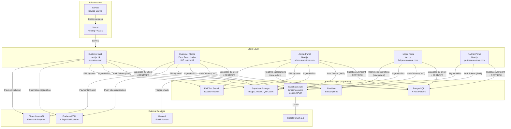
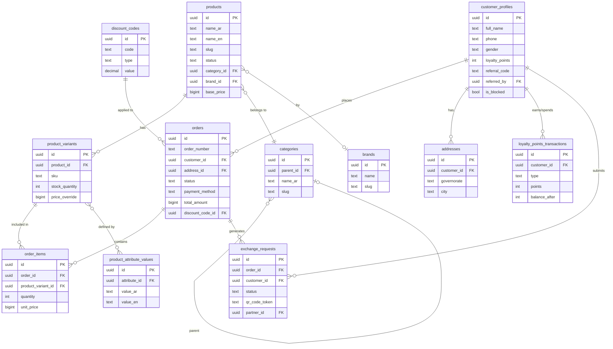
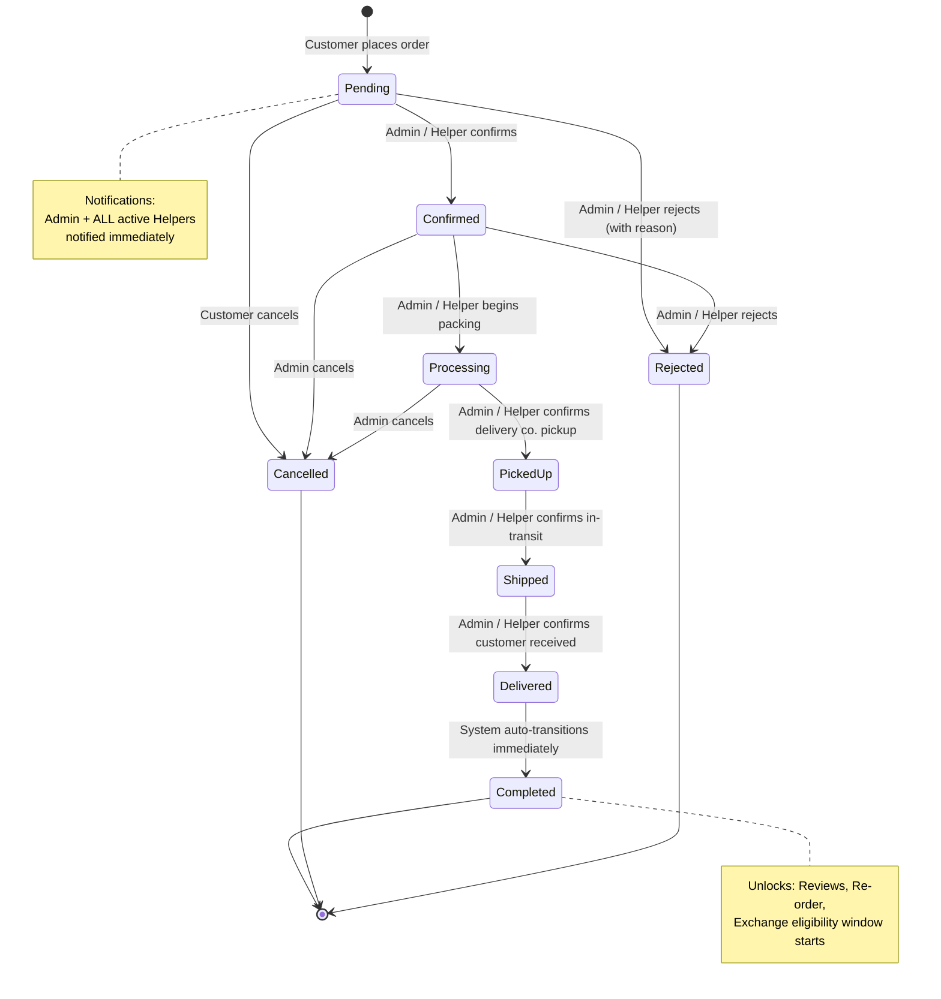
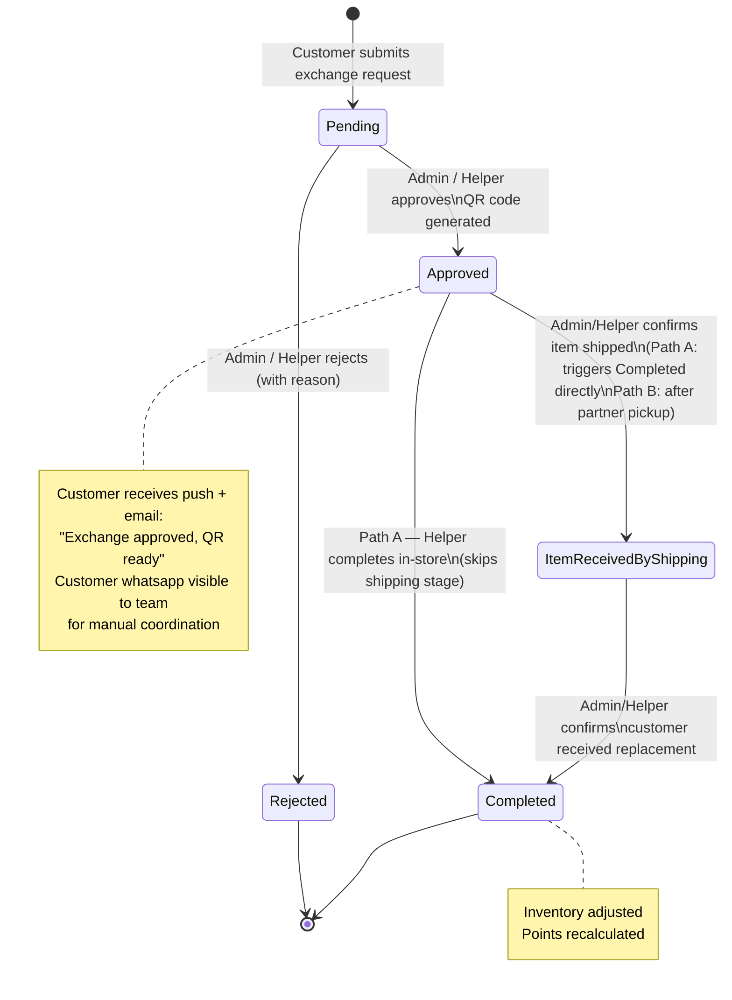

# EuroStore — Product Requirements Document (PRD)

---

## 1. Document Control

| Field        | Value                                                                 |
|--------------|-----------------------------------------------------------------------|
| Document     | EuroStore_PRD.md                                                      |
| Version      | 1.0                                                                   |
| Status       | DRAFT — Pending final Sham Cash API details & NFR sign-off            |
| Date         | 2025-07-01                                                            |
| Authors      | AI Principal Architect (generated from EuroStore_MasterPrompt v1.0)  |
| Review Cycle | Update after each sprint; all changes versioned in changelog below    |

### Changelog

| Version | Date       | Author | Change                                              |
|---------|------------|--------|-----------------------------------------------------|
| 1.0     | 2025-07-01 | AI     | Initial generation from master prompt + full Q&A    |

---

## 2. Executive Summary

**Euro Store** is a full-stack, bilingual (Arabic/English) fashion e-commerce platform built specifically for the Syrian market. Inspired by Zalando's global UX/UI standards, it combines online shopping with offline loyalty and exchange infrastructure via Helper (in-branch staff) and Partner (external pickup point) roles.

### Platform at a Glance

- **Five synchronized applications** in a Turborepo monorepo: Customer Web (Next.js 14), Customer Mobile (Expo React Native), Admin Panel (Next.js), Helper Portal (Next.js), Partner Portal (Next.js).
- **Core stack:** Supabase (PostgreSQL + Auth + Storage + Full-Text Search), Vercel hosting, Resend email, Expo + Firebase FCM for push notifications.
- **Adapter pattern** throughout — every third-party service is swappable with zero business-logic changes.
- **Arabic RTL primary**, English LTR secondary; user-toggled language and light/dark theme.
- **Currency:** SYP primary, USD secondary (admin-managed exchange rate).
- **Unique features:** O2O loyalty system (QR-based offline points), in-branch and partner-based exchange flow, single-use time-bound QR codes for exchanges, no-login browsing with login-on-action UX.

### Scope of This Document

All five applications, every feature, every database table, every API endpoint, all security controls, all notification flows, and all external integrations required to ship Euro Store v1.0.

### Out of Scope (v1.0 — see Section 24)

Beauty & personal care category, financial refunds via Sham Cash, Algolia migration, international payment gateways (Stripe), Cloudflare Stream for video CDN, multi-branch inventory, Vercel → VPS migration.

---

## 3. Goals & Success Metrics

### Business Objectives

| # | Objective                                                               |
|---|-------------------------------------------------------------------------|
| 1 | Provide a premium, frictionless online shopping experience for Syria    |
| 2 | Capture offline-to-online loyalty via QR-code scanning at branches      |
| 3 | Enable distributed exchange pickup via partner store network            |
| 4 | Give admin full visibility and control via real-time dashboard          |
| 5 | Build a migration-ready platform — no vendor lock-in                    |

### Key Performance Indicators (KPIs)

| KPI                                  | Target (to be set at launch)       |
|--------------------------------------|------------------------------------|
| Monthly Active Users                 | [TBD: post-launch baseline]        |
| Cart-to-Order Conversion Rate        | ≥ 3%                               |
| Average Order Value (SYP)            | [TBD: business target]             |
| Loyalty Program Participation        | ≥ 40% of repeat customers          |
| Exchange Request Resolution Time     | ≤ 48 hours from submission         |
| Order Confirmation Time              | ≤ 4 hours after placement          |
| Push Notification Open Rate          | ≥ 20%                              |
| Web Core Web Vitals — LCP            | [TBD — see Section 14]             |
| Mobile App Crash Rate                | < 0.1%                             |
| System Uptime                        | [TBD — see Section 14]             |

---

## 4. System Architecture Overview

### 4.1 Monorepo Structure

```
euro-store/
├── apps/
│   ├── web/          # Next.js 14 — Customer Storefront (eurostore.com)
│   ├── mobile/       # Expo React Native — iOS + Android
│   ├── admin/        # Next.js — Admin Panel (admin.eurostore.com)
│   ├── helper/       # Next.js — Helper Portal (helper.eurostore.com)
│   └── partner/      # Next.js — Partner Portal (partner.eurostore.com)
├── packages/
│   ├── ui/           # Shared design system + component library
│   ├── database/     # Supabase client, TypeScript types, migrations
│   ├── adapters/     # Adapter interfaces + all service implementations
│   ├── config/       # ESLint, TypeScript, Tailwind shared configs
│   └── shared/       # Shared utilities, types, constants, hooks
├── turbo.json
├── pnpm-workspace.yaml
├── package.json
└── .env.example
```

### 4.2 Architecture Diagram



### 4.3 Data Flow — Core Paths

#### Checkout Flow
Customer cart → Apply discount/points → Supabase RPC (atomic transaction: inventory lock + deduct + order create + points deduct) → Payment (COD: skip; Sham Cash: API call) → Notifications dispatched.

#### Exchange Flow
Customer submits form (reason + WhatsApp + optional photos) → Admin/Helper reviews → Approve (generate QR JWT) or Reject → Customer shows QR at branch/partner → QR scanned (validated server-side: signature + expiry + single-use flag) → Item verified → Status updated → Notifications dispatched.

#### Loyalty Offline Flow
Customer QR displayed → Helper camera scans → Decode customer_id → Helper enters invoice amount → Server calculates points (atomic: points added to customer_profiles + transaction logged) → Customer notified.

---

## 5. User Roles & Permission Matrix

### 5.1 Role Definitions

| Role           | Created By | Auth             | 2FA    | Portal            |
|----------------|------------|------------------|--------|-------------------|
| Customer       | Self        | Email+PW / Google OAuth | None | Web + Mobile |
| Admin (Main)   | —           | Email+PW         | TOTP mandatory | admin.eurostore.com |
| Sub-Admin      | Admin       | Email+PW         | TOTP mandatory | admin.eurostore.com |
| Helper         | Admin       | Email+PW         | None   | helper.eurostore.com |
| Partner        | Admin       | Email+PW         | None   | partner.eurostore.com |

### 5.2 Permission Matrix

| Feature / Action                        | Customer | Admin (Main) | Sub-Admin | Helper | Partner |
|-----------------------------------------|----------|--------------|-----------|--------|---------|
| Browse products (no login)              | ✅ | ✅ | — | — | — |
| Add to cart (no login)                  | ✅ | — | — | — | — |
| Add to wishlist (login required)        | ✅ | — | — | — | — |
| Checkout / Place order                  | ✅ | — | — | — | — |
| Cancel own order (Pending/Confirmed/Processing) | ✅ | — | — | — | — |
| View own order history                  | ✅ | — | — | — | — |
| Download own PDF invoice                | ✅ | — | — | — | — |
| Request exchange                        | ✅ | — | — | — | — |
| Redeem loyalty points at checkout       | ✅ | — | — | — | — |
| View loyalty balance & history          | ✅ | — | — | — | — |
| Write product review (post-Completed)   | ✅ | — | — | — | — |
| View/manage all orders                  | — | ✅ | [module] | ✅ (view+update) | — |
| Update order status                     | — | ✅ | [module] | ✅ | — |
| View/manage exchange requests           | — | ✅ | [module] | ✅ | [own queue] |
| Approve/reject exchange                 | — | ✅ | [module] | ✅ | — |
| Scan exchange QR (in-branch)            | — | — | — | ✅ | — |
| Scan exchange QR (partner store)        | — | — | — | — | ✅ |
| Confirm item receipt (partner)          | — | — | — | — | ✅ |
| Mark ready for delivery pickup          | — | — | — | — | ✅ |
| Confirm delivery company pickup (partner)| — | — | — | — | ✅ |
| Scan loyalty QR                         | — | — | — | ✅ | — |
| CRUD products                           | — | ✅ | [module] | ❌ (request only) | — |
| Submit product addition request         | — | — | — | ✅ | — |
| Approve/reject product requests         | — | ✅ | [module] | — | — |
| CRUD categories                         | — | ✅ | [module] | — | — |
| CRUD brands                             | — | ✅ | [module] | — | — |
| CRUD collections                        | — | ✅ | [module] | — | — |
| CRUD bundles                            | — | ✅ | [module] | — | — |
| CRUD discount codes                     | — | ✅ | [module] | — | — |
| Manage shipping rates                   | — | ✅ | [module] | — | — |
| Manage homepage banners/sections        | — | ✅ | [module] | — | — |
| View/manage customers                   | — | ✅ | [module] | — | — |
| Block/unblock customer                  | — | ✅ | [module] | — | — |
| Manually adjust customer loyalty points | — | ✅ | [module] | — | — |
| Moderate reviews                        | — | ✅ | [module] | — | — |
| View all reports                        | — | ✅ | [module] | — | — |
| Manage system settings                  | — | ✅ | [module=Full] | — | — |
| Manage currency / exchange rate         | — | ✅ | [module=Full] | — | — |
| Create/manage Helpers                   | — | ✅ | [module] | — | — |
| Create/manage Partners                  | — | ✅ | [module] | — | — |
| Create/manage Sub-Admins                | — | ✅ | [module=Full] | — | — |
| View audit logs                         | — | ✅ | [module] | — | — |
| View inventory levels                   | — | ✅ | [module] | ✅ (read-only) | — |

**Note:** `[module]` means Sub-Admin access is determined by their permission assignment for that module (View Only / Edit / Full Access). A sub-admin with no permission for a module cannot access it at all.

### 5.3 Sub-Admin Permission Levels

| Level      | Capabilities |
|------------|-------------|
| View Only  | Read-only access to all data in the module; no create/edit/delete |
| Edit       | Can read and edit/update records; cannot create new or delete |
| Full Access | Full CRUD including delete and approval actions within the module |

**Main Admin:** Always Full Access to everything — no restrictions, no module permissions system applies.

### 5.4 Sub-Admin Assignable Modules

Dashboard, Product Management, Category Management, Brand Management, Collection Management, Bundle Management, Order Management, Exchange Management, Customer Management, Discount Code Management, Loyalty System Config, Shipping Configuration, Homepage Management, Reports, System Settings, Audit Log, Sub-Admin Management, Helper Management, Partner Management.

---

## 6. Feature Specifications

### 6.1 Authentication & Registration

#### 6.1.1 Customer Registration (Email)

**Description:** New customers register using email, password, and full name. Phone number is required. Email verification is mandatory before account activation.

**User Story:** As a new visitor, I want to create an account so I can place orders and earn loyalty points.

**Flow:**
1. User clicks "Sign Up" → form: Full Name, Email, Password, Phone Number.
2. Client validates: name (non-empty), email (valid format), password (≥8 chars, ≥1 uppercase, ≥1 number), phone (valid Syrian format).
3. POST /api/auth/register → Supabase Auth creates user → `customer_profiles` row created → verification email sent (Resend).
4. User clicks email link → email verified → account activated.
5. System auto-generates: `referral_code` (8-char alphanumeric, unique), `loyalty_qr_code` (QR image stored in Supabase Storage).
6. If registration came from referral link (`?ref=CODE`), create `referrals` record with status `pending`.
7. Redirect: to last page before signup prompt, or homepage.

**Acceptance Criteria:**
- GIVEN a visitor submits valid registration data WHEN email is unique THEN account created, verification email sent, user sees "Check your email" screen.
- GIVEN a visitor submits an existing email THEN error: "Email already in use."
- GIVEN a visitor with unverified email tries to checkout THEN blocked with prompt to verify email.
- GIVEN referral code in URL THEN referral record created linking new user to referrer.

**Edge Cases:**
- Password too weak: specific error listing missing requirements.
- Phone format invalid: error with expected format.
- Email send fails: account still created; retry mechanism in UI with resend option.
- Referral code invalid/expired: registration succeeds silently; no referral record created.

#### 6.1.2 Customer Registration / Login (Google OAuth)

**Flow:**
1. User clicks "Continue with Google" → redirect to Google OAuth consent.
2. Supabase handles OAuth callback → `customer_profiles` row created if new user.
3. Phone number: NOT required for Google OAuth users (marked optional in profile).
4. Referral code honored if present in session before OAuth.

**Edge Cases:**
- If Google account email matches existing email-registered account: accounts are linked (Supabase handles this).

#### 6.1.3 Customer Login

**Flow:**
1. POST /api/auth/login with email + password → Supabase returns JWT access token + refresh token.
2. Tokens stored in httpOnly cookies (web) / SecureStorage (mobile).
3. **Cart merge:** After successful login, client reads `sessionStorage.getItem('guest_cart')`, POSTs to POST /api/cart/merge, clears sessionStorage.
4. Redirect to pre-login page (stored in sessionStorage before redirect).

**Failed Login:** After 5 consecutive failures from same IP → rate-limited for 15 minutes.

#### 6.1.4 Admin / Sub-Admin Login (with TOTP)

**Flow:**
1. POST /api/admin/auth/login with email + password → returns `{ status: "2fa_required", partial_token: "..." }`.
2. Admin enters 6-digit TOTP from Google Authenticator → POST /api/admin/auth/verify-2fa with `{ partial_token, totp_code }`.
3. Returns full JWT. If TOTP invalid: error; if 3 consecutive failures: lock account for 30 minutes.
4. If TOTP not yet set up for new admin: redirect to TOTP setup flow before any other access.

**TOTP Setup Flow (first login):**
1. Server generates TOTP secret → returns QR code URL.
2. Admin scans QR with Google Authenticator app.
3. Admin enters verification code → TOTP confirmed → `admin_profiles.totp_enabled = true`.
4. No bypass path exists — admin is blocked from all admin features until TOTP is configured.

#### 6.1.5 Password Reset

1. POST /api/auth/forgot-password with email → Resend sends reset link (expires 1 hour).
2. User clicks link → POST /api/auth/reset-password with token + new password.
3. All existing sessions invalidated on successful reset.

---

### 6.2 Product Catalog

#### 6.2.1 Product Attributes System

**Default Attributes (always present on every product):**
- Color (`type: 'color'`) — renders as color swatches in UI
- Size (`type: 'size'`) — renders as size buttons

**Custom Attributes:** Admin can create any attribute with name (AR + EN) and type (`text`). Examples: Material, Fit, Width, Style, Season.

**Filter Auto-Generation Rule:** Every attribute (default + custom) automatically generates a faceted filter on product listing pages with live result counts. Adding a new attribute in Admin Panel requires zero code changes — filter appears dynamically on the next page render.

#### 6.2.2 Product Variants (SKUs)

Each unique combination of attribute values = one Product Variant (SKU).

Example: Product "Classic Oxford Shirt"
- Color: White, Blue, Black
- Size: S, M, L, XL
→ Up to 12 variants (SKUs), each with independent stock quantity.

**Variant price:** Can be set individually (override) or inherit product base price.

**UI behavior for unavailable variants:** If a specific combination has no variant record, that combination is grayed out / unselectable in the UI. Customers cannot select unavailable combinations.

#### 6.2.3 Product States

| State     | Customer-Visible | Purchasable | Special UI                          |
|-----------|-----------------|-------------|--------------------------------------|
| Draft     | No              | No          | —                                   |
| Published | Yes             | Yes (stock > 0) | Normal product display           |
| Out of Stock | Yes          | No          | "Notify Me" CTA per variant         |
| Archived  | No              | No          | —                                   |

#### 6.2.4 Product Badges

| Badge  | Trigger                                                         | [ADMIN_CONFIGURABLE] |
|--------|-----------------------------------------------------------------|---------------------|
| New    | `created_at` ≥ (current date − `new_badge_days`)               | default: 30 days    |
| Sale   | `discount_percentage IS NOT NULL` AND within discount date range | automatic           |

Both badges can appear simultaneously. Displayed on product cards in listing views only.

#### 6.2.5 "Notify Me When Back In Stock"

- Appears per variant when `stock_quantity = 0` and product is `published`.
- Customer clicks → creates `notify_me_subscriptions` record (login required if not authenticated).
- When admin restocks a variant (stock_quantity goes from 0 to > 0): system queries all active subscriptions for that variant → dispatches push notification + email to each subscribed customer → marks `is_notified = true`.
- A customer can only have one active subscription per variant.

#### 6.2.6 Product Media

| Type   | Count     | Input Method                                 | Storage                    |
|--------|-----------|-----------------------------------------------|----------------------------|
| Images | Unlimited | File upload (JPEG/PNG/WebP, max 5MB each) OR URL import from internet | Supabase Storage |
| Videos | Unlimited | File upload (MP4, max 100MB each)            | Supabase Storage           |

URL import: Admin pastes image URL → server downloads image → stores in Supabase Storage (not hotlinking).

**Primary image:** One image per product designated as primary (displayed in listing cards, OG meta, etc.).

#### 6.2.7 Size Guide

- Defined at category level OR overridden at product level.
- Content: JSON structure with size labels and measurements (chest, waist, hip, etc.).
- Rendered as a table on the product detail page.
- If product has no size guide AND category has no size guide: size guide section hidden.

#### 6.2.8 Product Bundles

- Admin creates a bundle with: name (AR+EN), description (AR+EN), price (SYP), list of `{product_variant_id, quantity}`.
- Bundle price is a single fixed price (not the sum of individual item prices).
- When bundle is added to cart: each bundle item is checked individually for stock.
- Stock deduction: each item deducted individually on order placement.
- Points calculation: based on bundle price (treated as one "product" for points calculation).
- Exchange: the entire bundle is the exchangeable unit; bundle-level exchange request only.

#### 6.2.9 Reviews

- **Eligibility:** Order must be in `completed` status. One review per product per order.
- **Moderation:** All reviews start as `pending`. Admin approves or rejects. Only `approved` reviews visible to customers.
- **Content:** Star rating (1–5, integer) + optional text comment.
- **Display:** Average rating calculated dynamically from `approved` reviews. Count shown.
- **Admin notification:** No automatic alert for new reviews (admin polls the review moderation queue).

**User Story:** As a customer who completed an order, I want to rate and review products so I can share my experience.

**Acceptance Criteria:**
- GIVEN order status is Completed WHEN customer opens order detail THEN "Write Review" button appears for each product in the order.
- GIVEN customer submits review THEN review status is pending; customer sees "Review submitted for moderation."
- GIVEN admin approves review THEN review is visible on product page.

---

### 6.3 Discovery & Search

#### 6.3.1 Homepage Sections

All sections are fully admin-controlled via Homepage Management module. Every section has zero hardcoded data.

| Section          | Content Source                             | Admin Controls                                                |
|------------------|--------------------------------------------|-----------------------------------------------------------------|
| Main Banner      | Admin-managed slides                        | Add/edit/delete/reorder slides; each: image or video file, CTA link, overlay text (AR+EN) |
| New Arrivals     | Latest `published` products ordered by `created_at` DESC | Toggle visibility; set item count [ADMIN_CONFIGURABLE, default: 12] |
| Sales/Discounts  | `published` products with active `discount_percentage` | Toggle visibility                                |
| Featured Brands  | Admin-selected brands                       | Select brands; set display order                              |
| Most Popular     | Products ordered by total sales count       | Toggle visibility                                            |

**Rendering rule:** Sections with zero matching products are hidden automatically (no empty sections displayed).

#### 6.3.2 Search

**Implementation:** Supabase Full-Text Search (PostgreSQL `tsvector`). Columns indexed: product name AR, product name EN, description AR, description EN, brand name, category name.

**Autocomplete:** GET /api/search/suggestions?q={query} — triggered after 2 characters, debounced 300ms, returns up to 8 suggestions (product names + category names + brand names).

**Zero-result searches:** Logged in `search_analytics`. Admin sees these in the Search Analytics Report.

**Future migration:** Algolia via `ISearchAdapter` — zero business logic changes required.

#### 6.3.3 Product Filters

Filters operate simultaneously with live result counts. Available filters:
- Price range (slider with SYP values, OR USD if display_currency=USD)
- Color (visual swatches from `product_attribute_values`)
- Size (buttons from `product_attribute_values`)
- Brand (multi-select checkboxes)
- Discount % range
- Category tree navigation
- All admin-defined custom attributes (dynamic — generated from `product_attributes` table)

**Live counts:** Each filter value shows how many products match the CURRENT active filter set + that value. Uses aggregated SQL queries, not cached counts.

---

### 6.4 Cart

#### 6.4.1 Guest Cart (Not Logged In)

- Stored in browser `sessionStorage` under key `eurostore_guest_cart`.
- Format: `[{ variantId: string, quantity: number }]`
- **Clears on:** Tab close, browser close, or navigating away from the site (sessionStorage standard behavior).
- **Persists across:** Page navigations within the same tab session.
- No server-side storage for guest carts.

#### 6.4.2 Authenticated Cart

- Stored server-side in `cart_items` database table.
- Persists across devices and sessions.

#### 6.4.3 Cart Merge on Login

On successful login:
1. Client reads `sessionStorage.getItem('eurostore_guest_cart')` → parses JSON.
2. If non-empty: POST /api/cart/merge `{ items: [...] }`.
3. Server logic per item:
   - If variant already in user's server cart: `quantity = min(existing + guest_qty, available_stock)`.
   - If variant not in user's cart: add item with `quantity = min(guest_qty, available_stock)`.
4. `sessionStorage.removeItem('eurostore_guest_cart')`.
5. Client refreshes cart display from server.

#### 6.4.4 Stock Validation

- Stock is NOT reserved when item is added to cart.
- Stock is validated and deducted ONLY at the moment of payment/order confirmation (`SELECT FOR UPDATE`).
- If stock is insufficient at checkout time: error returned specifying which items are affected, customer is shown updated availability.

#### 6.4.5 Minimum Order Value

- `[ADMIN_CONFIGURABLE]` via system_settings key `min_order_value_syp`. Default: `0` (no minimum).
- If set, checkout is blocked if cart subtotal (after discounts) < minimum. Error shown in cart.

---

### 6.5 Checkout Flow

**Step 1: Cart Review**
- Show items, quantities, prices, subtotal.
- Stock validation check on page load (highlight out-of-stock items).
- If min_order_value > 0 and not met: block proceed with message.

**Step 2: Authentication Gate**
- If not logged in: show login/register modal. After login, return to checkout.

**Step 3: Delivery Address**
- Show saved addresses (default pre-selected).
- Option to add new address: Governorate (dropdown — all 14 Syrian governorates), City (text), District (text, optional), Additional Details (text, optional).
- Shipping cost shown based on selected governorate from `shipping_rates` table.

**Step 4: Discount Code**
- Optional. Input field + "Apply" button.
- Validation: code exists, active, not expired, eligibility met, cart value meets min, usage limits not reached.
- Shows discount amount if valid. Error message if invalid.

**Step 5: Loyalty Points**
- If customer has points ≥ `loyalty_min_redemption_pts`: show "Use X points (= Y SYP)" toggle.
- Max deduction: `min(available_points × loyalty_point_value_syp, order_subtotal × loyalty_max_redemption_pct / 100)`.
- Points and discount codes are stackable (both can be applied simultaneously).

**Step 6: Payment Method**
- COD (Cash on Delivery): always available.
- Sham Cash: show if available.
- International Cards: UI stub shown but disabled (grayed out with "Coming Soon" label).

**Step 7: Order Summary Review**
- Items + quantities + unit prices.
- Subtotal, discount (code), discount (points), shipping cost.
- **Total to pay.**
- Customer's delivery address.
- Payment method.

**Step 8: Place Order**

For COD:
1. POST /api/orders → atomic DB transaction: inventory lock + deduct + order create + order_items create + loyalty points deduct + discount_code_usage create + audit log.
2. Order created with `status: 'pending'`, `payment_status: 'pending'`.
3. Success page → confirmation email + push notification sent.

For Sham Cash:
1. POST /api/orders with `payment_method: 'sham_cash'` → order created in `pending` state.
2. POST /api/payments/sham-cash/initiate → [TBD: exact flow per Sham Cash API docs].
3. On payment success callback: order moves to normal flow.
4. On payment FAILURE: order status set to `cancelled`; cart items are RESTORED to customer's server-side cart; customer shown failure message with cart retained. No auto-retry — customer must initiate new order.

**Order Number Format:** `EUR-XXXXXXXX` where X is a zero-padded, auto-incrementing integer (8 digits, seeded from 00000001). Example: `EUR-00000001`.

---

### 6.6 Order Management

#### 6.6.1 Order Status State Machine

```
Pending → Confirmed → Processing → Picked Up → Shipped → Delivered → Completed
       ↘ Cancelled (by customer or admin)
       ↘ Rejected (by admin/helper — with mandatory reason)
```

| Status      | Who Transitions To This | Cancellation Allowed | Customer CTA Available |
|-------------|--------------------------|---------------------|--------------------------|
| Pending     | System (on order placement) | ✅ Customer + Admin | Cancel |
| Confirmed   | Admin or Helper         | ✅ Admin only       | Cancel |
| Processing  | Admin or Helper         | ✅ Admin only       | Cancel |
| Picked Up   | Admin or Helper (confirms delivery co collected) | ❌ Hard cutoff | — |
| Shipped     | Admin or Helper         | ❌            | — |
| Delivered   | Admin or Helper         | ❌            | Request Exchange (within window) |
| Completed   | System (auto, immediately after Delivered) | ❌ | Write Review, Re-order, Download Invoice |
| Cancelled   | Customer (Pending only) or Admin (Pending/Confirmed/Processing) | — | — |
| Rejected    | Admin or Helper         | —             | — |

**Auto-cancellation:** DISABLED. Pending orders remain open indefinitely until admin/helper acts.

**Rejection:** Requires `rejection_reason` text. Customer notified with reason.

**Cancellation by Customer:** Only while order is in `Pending` state. After that, customer cannot cancel self-service.

#### 6.6.2 Customer Order Actions

| Action                | When Available             | Notes                           |
|------------------------|------------------------------|-----------------------------------|
| Cancel order          | Status: Pending only        | Stock returned; points/discount restored if used |
| Download PDF Invoice  | Any time, any status        | Includes all order data         |
| Re-order              | Status: Completed           | Pre-fills cart with same items; stock validated |
| Write review          | Status: Completed           | Per product in order            |
| Request exchange      | Status: Delivered, within exchange window | After admin-configured window: button hidden |

#### 6.6.3 Order Cancellation Logic

On successful cancellation:
1. `orders.status` → `cancelled`
2. Inventory: each `order_items` variant's `stock_quantity` increased back.
3. If discount code used: `discount_code_usages` record deleted; `discount_codes.uses_count` decremented.
4. If loyalty points used: points restored (positive transaction added).
5. For Sham Cash paid orders: [TBD — refund mechanism per Sham Cash API when available].
6. Customer notified by push + email.

---

### 6.7 Payment System

#### 6.7.1 Cash on Delivery (COD)

- No payment collection at order time.
- Order placed successfully; payment collected on delivery by delivery company.
- `payment_status` remains `pending` until admin manually marks as paid after delivery confirmation.

#### 6.7.2 Sham Cash Integration

**Current status:** API documentation / credentials not yet available. **[TBD: Full integration spec pending Sham Cash API docs.]**

**Architecture:** `IShamCashAdapter` implements `IPaymentAdapter`.

```typescript
interface IPaymentAdapter {
  charge(orderId: string, amount: number, currency: 'SYP'): Promise<PaymentResult>;
  verify(transactionId: string): Promise<PaymentStatus>;
  getStatus(transactionId: string): Promise<PaymentStatus>;
  refund(transactionId: string, amount?: number): Promise<RefundResult>; // Stub — v2
}
```

**Required implementation:**
- `payment_transactions` record created for every Sham Cash attempt (success or failure).
- Full API request/response logged in `payment_transactions.provider_response` (JSONB).
- On failure: order `cancelled`, items restored to cart, customer notified.
- On success: normal order flow continues.
- Webhook endpoint: POST /api/webhooks/sham-cash (server-side validation of webhook signature).

#### 6.7.3 Currency Management

- All prices stored in **SYP** (bigint, value in whole Syrian Pounds).
- USD display: `displayed_usd = syp_price / usd_exchange_rate` (admin-managed rate).
- Currency toggle is GLOBAL (admin sets for all users via System Settings).
- Exchange rate key: `system_settings['usd_exchange_rate']` — admin updates manually.
- Prices at order time: snapshot saved in both `orders.total_amount` (SYP) and `orders.exchange_rate_at_order` (USD rate used, if applicable).

---

### 6.8 Shipping & Delivery

#### 6.8.1 Rate Configuration

- Flat rate per Syrian governorate — 14 governorates: Damascus, Rural Damascus, Aleppo, Homs, Hama, Latakia, Tartus, Idlib, Deir ez-Zor, Raqqa, Hasakah, Daraa, Sweida, Quneitra.
- Each governorate: `rate` (SYP), `free_shipping_threshold` (nullable — uses global if null).
- Global free shipping threshold: `system_settings['free_shipping_global_threshold_syp']` (nullable — disabled if null).
- **Rule:** If customer's cart subtotal ≥ applicable free_shipping_threshold → shipping cost = 0.

All values in `shipping_rates` table. Zero code changes to update rates — admin edits via Admin Panel.

#### 6.8.2 Delivery Partner

External delivery company — not yet selected. No driver management in platform. Admin/Helper manually updates order statuses as they receive confirmation from the delivery company (via phone, WhatsApp, etc.).

---

### 6.9 Exchange System

#### 6.9.1 Eligibility Rules

| Rule                      | Value                                                         |
|----------------------------|------------------------------------------------------------------|
| Return window             | `[ADMIN_CONFIGURABLE]` key: `exchange_window_days`, default: 7 days from delivery date |
| Item condition            | Unused, original condition, all tags and labels intact        |
| Per-order limit           | `[ADMIN_CONFIGURABLE]` key: `exchange_per_order_limit`, default: 1 |
| Exchange scope            | Any product in store (customer can exchange for a different product entirely) |
| Proof photos              | Required — customer uploads 1 to `exchange_proof_photo_limit` photos [ADMIN_CONFIGURABLE, default: 3] |

#### 6.9.2 Exchange Request Submission Flow

1. Customer opens Completed/Delivered order → taps "Request Exchange" on eligible item.
2. Form fields: Reason for exchange (text, required), WhatsApp number for contact (pre-filled from profile if available, required), Photo upload (1–3 images of the item, required).
3. POST /api/exchanges → creates `exchange_requests` record (`status: 'pending'`).
4. Photos uploaded to Supabase Storage → URLs stored in `exchange_request_images`.
5. Admin AND all active Helpers receive immediate notification (push + email): "New exchange request from [customer name]."
6. Customer sees exchange request status in their profile.

#### 6.9.3 Exchange Status State Machine

```
Pending → Approved → Item Received by Shipping Co. → Completed
        ↘ Rejected (terminal)
```

| Status                        | Arabic Label                          | Trigger                                             |
|---------------------------------|-----------------------------------------|--------------------------------------------------------|
| `pending`                     | بانتظار تأكيد الطلب                     | Customer submits exchange request                    |
| `approved`                    | تم تأكيد الطلب                          | Admin/Helper approves → QR code generated            |
| `rejected`                    | تم رفض الطلب                           | Admin/Helper rejects (terminal state)                |
| `item_received_by_shipping`   | تم استلام الطلب من شركة الشحن           | Admin/Helper confirms delivery company received item |
| `completed`                   | تم استلام الطلب من العميل               | Admin/Helper confirms customer received replacement  |

**All status transitions notify the customer via push notification + email.**

**Manual transitions:** All status changes are confirmed manually by Admin or Helper — no automatic transitions in the exchange flow.

#### 6.9.4 Exchange Approval Flow

On Admin/Helper approval:
1. `exchange_requests.status` → `approved`.
2. `resolution_path` set: `'helper'` (in-branch) or `'partner'` (external).
3. If `partner` path: `partner_id` assigned (admin selects which partner location).
4. Server generates exchange QR code: JWT `{ exchange_request_id, exp: now + 72h }` signed with `EXCHANGE_QR_SECRET` env variable.
5. Token stored in `exchange_requests.qr_code_token`; expiry in `qr_code_expires_at`.
6. Customer push notification: "Exchange approved! Present your QR code at the [branch/partner store]."
7. Customer app: QR code becomes visible in exchange request detail screen.

#### 6.9.5 QR Code Validation (Server-Side)

When QR is scanned:
1. Decode JWT → verify signature → verify not expired → verify `qr_code_used_at IS NULL`.
2. If any check fails: scan rejected; helper/partner sees error message.
3. If valid: QR marked used (`qr_code_used_at = now()`); item details displayed.

**QR Expiry:** `[ADMIN_CONFIGURABLE]` key: `exchange_qr_expiry_hours`, default: `72` (3 days).

If QR expires before use: customer must contact admin to re-generate. Admin can regenerate QR by re-approving the same exchange request.

#### 6.9.6 Path A: Exchange via Helper (In-Branch)

1. Customer arrives at Euro Store branch with item and exchange QR.
2. Helper opens Helper Portal → Exchange QR Processing → camera scan.
3. System validates QR (see 6.9.5); displays: original order item details, product image, condition requirements, customer WhatsApp number.
4. Helper physically verifies item condition.
5. Helper selects replacement product variant in portal (search by SKU or product name).
6. Helper taps "Complete Exchange" → atomic transaction:
   - `exchange_requests.status` → `item_received_by_shipping` then immediately `completed` (Path A skips shipping stage).
   - Old item variant's `stock_quantity` incremented by 1.
   - New replacement variant's `stock_quantity` decremented by 1 (with `SELECT FOR UPDATE`).
   - Loyalty points from original order: reversed (negative transaction).
   - Loyalty points for replacement item value: added (new positive transaction).
7. Customer receives new item physically.
8. Customer receives push + email notification: "Exchange complete."

**Note:** Price difference between original item and replacement is NOT settled financially in v1.0 (no refund/charge mechanism). This is handled offline if needed.

#### 6.9.7 Path B: Exchange via Partner Store

1. Customer arrives at assigned partner store with item and exchange QR.
2. Partner opens Partner Portal → camera scan of exchange QR.
3. System validates QR; displays: item image, SKU, condition requirements.
4. Partner verifies item → taps "Confirm Receipt" → `exchange_requests.status` → (internal stage, customer notified).
5. Admin/Helper receives notification: partner has received item.
6. Partner taps "Ready for Delivery Company Pickup" (in Partner Portal).
7. External delivery company collects returned item from partner.
8. Partner taps "Confirm Delivery Company Collected" → `status` → `item_received_by_shipping`.
9. Euro Store team processes and dispatches replacement item to customer.
10. Admin/Helper taps "Replacement Delivered to Customer" → `status` → `completed`.
11. Inventory adjustments and points recalculation (same as Path A step 6, but triggered at step 9).

**Customer notification:** At every status transition (all 5 stages).

---

### 6.10 Loyalty Points System

#### 6.10.1 Points Formula

`[ADMIN_CONFIGURABLE]` — stored in `system_settings`:

| Key                           | Default | Meaning                                         |
|---------------------------------|---------|----------------------------------------------------|
| `loyalty_earn_amount_syp`     | `1000`  | Customer spends this many SYP to earn points    |
| `loyalty_earn_points`         | `10`    | Points earned per `loyalty_earn_amount_syp`     |
| `loyalty_point_value_syp`     | `10`    | Redemption value: 1 point = this many SYP       |
| `loyalty_min_redemption_pts`  | `100`   | Minimum points balance required to redeem       |
| `loyalty_max_redemption_pct`  | `30`    | Max % of order value that can be paid by points |

**Formula to earn points from purchase:**
`points_earned = floor(order_subtotal_syp / loyalty_earn_amount_syp) × loyalty_earn_points`

**Calculation uses original price (before any discount applied).**

Changing the formula does NOT retroactively affect already-earned points.

#### 6.10.2 Earning Points

| Trigger          | How                                                                | Timing              |
|--------------------|-----------------------------------------------------------------------|------------------------|
| Online purchase  | Automatic calculation on order creation                            | On order Confirmed  |
| Offline purchase | Helper scans customer loyalty QR → enters invoice amount → system calculates | Immediately on scan |
| Referral reward  | Automatic when referred friend's first order reaches Confirmed     | On referree's first Confirmed order |

#### 6.10.3 Customer Loyalty QR Code

- One permanent QR code per customer. Content: `{ type: 'loyalty', customer_id: UUID }`.
- Generated at registration. Stored as PNG in Supabase Storage.
- Displayed in: customer app profile, customer web profile. Downloadable/shareable.
- Never expires. Not related to exchange QR codes.

#### 6.10.4 Offline Loyalty Processing (Helper Portal)

1. Helper opens Loyalty Processing in Helper Portal → camera scan.
2. Decode QR → extract `customer_id` → lookup customer.
3. Helper sees: customer name, current points balance.
4. Helper enters invoice amount (SYP, numeric input).
5. System shows calculated points to be awarded.
6. Helper taps "Confirm" → atomic transaction: `customer_profiles.loyalty_points` += earned_points; `loyalty_points_transactions` record created.
7. Customer receives push + email: "You earned X points! Balance: Y."

#### 6.10.5 Offline Points Redemption (Helper Portal)

1. Helper opens Loyalty Processing → camera scan of customer loyalty QR.
2. Helper sees: customer name, current points balance, current point value.
3. Helper enters amount to deduct from invoice (SYP), system shows equivalent points.
4. Or Helper enters points to redeem → system shows SYP equivalent.
5. Validation: `points_to_redeem >= loyalty_min_redemption_pts`; `syp_equivalent <= offline_invoice_amount × loyalty_max_redemption_pct / 100`.
6. Helper taps "Confirm Redemption" → atomic transaction: points deducted, transaction logged.
7. Customer receives push + email: "X points redeemed — Balance: Y."

#### 6.10.6 Points on Exchange

- Points from original order: **REVERTED** (negative loyalty transaction created for original points earned).
- Points for replacement item: **RE-CALCULATED** from scratch based on replacement item's price.
- Net effect: customer ends up with points as if they had originally purchased the replacement item.

---

### 6.11 Referral System

| Property          | Value                                                                 |
|--------------------|---------------------------------------------------------------------------|
| Type              | Single-level (A refers B; B refers C → A gets nothing from C)        |
| Trigger           | Referred friend's FIRST order reaches `confirmed` status             |
| Reward recipient  | Referring customer only                                              |
| Reward type       | Loyalty points                                                       |
| Reward amount     | `[ADMIN_CONFIGURABLE]` key: `referral_bonus_points`, default: `50`   |
| Referral link     | `eurostore.com/?ref={referral_code}` (also works as promo code text) |
| Customer sees     | Unique referral link + code in profile → "Invite Friends" section    |
| Attribution       | Referral code stored in sessionStorage/cookie on first visit; linked at registration |

**Edge Case:** If referred user was already registered (no referral attribution) — no reward issued.

---

### 6.12 Discount Codes

| Property           | Options                                                         |
|----------------------|---------------------------------------------------------------------|
| Eligibility        | `all_users` OR `first_time_buyers` (no previous completed orders) |
| Min cart value     | Optional SYP amount                                             |
| Scope              | Entire store / specific categories (multi-select) / specific products (multi-select) |
| Discount type      | Percentage (%) / Fixed amount (SYP)                            |
| Total usage limit  | Optional — max total redemptions                               |
| Per-user limit     | Optional — max times one user can use this code                |
| Date validity      | Optional start and end dates                                   |
| Stackable          | ✅ combinable with loyalty points                               |

**Validation order at checkout:** Active → not expired → eligibility check → min cart value → scope match → usage limits. First failed check stops validation with specific error.

---

### 6.13 Wishlist

- Private by default. Multiple items.
- Toggle item in/out of wishlist (login required).
- Shareable: customer generates public share URL → `eurostore.com/wishlist/{share_token}` (read-only public view).
- `share_token`: UUID generated on first share action; stored in `customer_profiles.wishlist_share_token`.
- If wishlist item goes out of stock: shown with "Out of Stock" indicator, not removed.

---

### 6.14 Product Sharing

Platforms available on every product page and mobile app product screen:

1. WhatsApp (using `whatsapp://send?text={URL}` or `https://wa.me?text=`)
2. Facebook (using `https://www.facebook.com/sharer/sharer.php?u=`)
3. Instagram (copy link — direct Instagram sharing requires app SDK; fallback: copy link)
4. Twitter / X (`https://twitter.com/intent/tweet?url=`)
5. Telegram (`https://t.me/share/url?url=`)
6. Copy Link (clipboard API)

Shared URL format: `eurostore.com/products/{slug}` with Open Graph meta tags for rich previews.

---

### 6.15 Admin Panel Features

#### 6.15.1 Dashboard

Real-time KPIs (live queries, no caching):
- Revenue today / this week / this month (in SYP + USD equivalent).
- Orders by status (count badges).
- Low-stock items count (with link to inventory report).
- New customers today / this week.
- Pending exchange requests count.

#### 6.15.2 Reports

All reports: date range picker + export to CSV / Excel (.xlsx) / PDF.

| Report                    | Key Dimensions                                                      |
|------------------------------|---------------------------------------------------------------------|
| Sales                     | Revenue by date, product, category, brand                          |
| Orders                    | Count/revenue by status, governorate, payment method                |
| Customers                 | New vs. returning, acquisition source (organic/referral)            |
| Inventory                 | Stock levels per SKU, low-stock items                              |
| Loyalty Points            | Total earned, spent, balance distribution across customers          |
| Referral                  | Total referrals, conversion rate, points paid out                  |
| Exchange / Return         | Requests by status, path (helper vs. partner), resolution time     |
| Search Analytics          | Top searched terms, zero-result searches, trends                   |
| Discount Code Performance | Usage count per code, revenue attributed, redemption by user type  |

#### 6.15.3 Audit Log

- Records every create/update/delete action by admin, helper, and partner.
- Fields: actor ID, actor role, action type, entity type, entity ID, before state (JSONB), after state (JSONB), IP address, timestamp.
- Filterable by: actor, action type, date range.
- Exportable: CSV.
- Retention: indefinite (no expiry).

---

### 6.16 Helper Portal Features

| Feature                  | Detail                                                              |
|----------------------------|---------------------------------------------------------------------|
| Dashboard                | Count of pending orders + pending exchange requests (live)          |
| Order Queue              | All actionable orders; update status; confirm delivery co. pickup   |
| Loyalty QR Processing    | Camera scan → enter amount → points added or deducted               |
| Exchange QR Processing   | Camera scan → verify item → select replacement → complete exchange  |
| Product Requests         | Submit new product addition request (admin must approve before publishing) |
| Inventory View           | Read-only: current stock per SKU; low-stock alert list             |

---

### 6.17 Partner Portal Features

| Feature                  | Detail                                                              |
|----------------------------|---------------------------------------------------------------------|
| Dashboard                | Items awaiting receipt from customers                               |
| Exchange Queue           | Approved exchanges assigned to this partner                         |
| QR Scanner               | Camera scan of customer exchange QR                                 |
| Item Verification        | View item image, SKU, condition requirements                        |
| Confirm Receipt          | Confirm item received from customer                                 |
| Mark Ready               | "Ready for delivery company pickup"                                 |
| Confirm Pickup           | Confirm delivery company collected the item                         |

---

### 6.18 Customer Profile

| Field              | Required | Notes                                                  |
|----------------------|------------|-----------------------------------------------------------|
| Full Name          | ✅ Yes   | Editable                                               |
| Email              | ✅ Yes   | Verified; read-only after registration                 |
| Phone Number       | ✅ Yes (email users) / Optional (Google users) | Editable |
| Gender             | Optional | Male / Female only                                    |
| Saved Addresses    | Multiple | Up to 10 saved addresses; one marked default           |
| Profile Photo      | ❌ No    | Not supported                                          |
| Loyalty QR Code    | Auto     | Permanent, displayed and downloadable                  |
| Referral Code/Link | Auto     | Visible in profile → "Invite Friends"                  |

---

## 7. Database Schema

### 7.1 Design Principles

- All primary keys: UUID v4 (`gen_random_uuid()`).
- All timestamps: `timestamptz` (UTC).
- All monetary amounts: `bigint` (whole Syrian Pounds — no decimals/cents).
- All text fields: `text` (not `varchar`).
- Row Level Security (RLS) enabled on ALL tables.
- Every write to `orders`, `loyalty_points_transactions`, `exchange_requests`: wrapped in ACID transaction.

### 7.2 Complete Table Definitions

```sql
-- =============================================
-- AUTHENTICATION EXTENSION TABLES
-- =============================================

CREATE TABLE customer_profiles (
  id                      UUID PRIMARY KEY REFERENCES auth.users(id) ON DELETE CASCADE,
  full_name               TEXT NOT NULL,
  phone                   TEXT,
  gender                  TEXT CHECK (gender IN ('male', 'female')),
  loyalty_points          INTEGER NOT NULL DEFAULT 0 CHECK (loyalty_points >= 0),
  referral_code           TEXT UNIQUE NOT NULL,
  referred_by             UUID REFERENCES customer_profiles(id),
  wishlist_share_token    UUID,
  qr_code_url             TEXT,
  is_blocked              BOOLEAN NOT NULL DEFAULT FALSE,
  created_at              TIMESTAMPTZ NOT NULL DEFAULT NOW(),
  updated_at              TIMESTAMPTZ NOT NULL DEFAULT NOW()
);

CREATE TABLE admin_profiles (
  id                      UUID PRIMARY KEY REFERENCES auth.users(id) ON DELETE CASCADE,
  full_name               TEXT NOT NULL,
  is_sub_admin            BOOLEAN NOT NULL DEFAULT FALSE,
  totp_secret             TEXT,
  totp_enabled            BOOLEAN NOT NULL DEFAULT FALSE,
  is_active               BOOLEAN NOT NULL DEFAULT TRUE,
  created_by              UUID REFERENCES admin_profiles(id),
  created_at              TIMESTAMPTZ NOT NULL DEFAULT NOW(),
  updated_at              TIMESTAMPTZ NOT NULL DEFAULT NOW()
);

CREATE TABLE sub_admin_permissions (
  id                      UUID PRIMARY KEY DEFAULT gen_random_uuid(),
  admin_id                UUID NOT NULL REFERENCES admin_profiles(id) ON DELETE CASCADE,
  module                  TEXT NOT NULL,
  permission_level        TEXT NOT NULL CHECK (permission_level IN ('view_only', 'edit', 'full_access')),
  created_at              TIMESTAMPTZ NOT NULL DEFAULT NOW(),
  UNIQUE (admin_id, module)
);

CREATE TABLE helper_profiles (
  id                      UUID PRIMARY KEY REFERENCES auth.users(id) ON DELETE CASCADE,
  full_name               TEXT NOT NULL,
  branch                  TEXT,
  is_active               BOOLEAN NOT NULL DEFAULT TRUE,
  created_by              UUID NOT NULL REFERENCES admin_profiles(id),
  created_at              TIMESTAMPTZ NOT NULL DEFAULT NOW(),
  updated_at              TIMESTAMPTZ NOT NULL DEFAULT NOW()
);

CREATE TABLE partner_profiles (
  id                      UUID PRIMARY KEY REFERENCES auth.users(id) ON DELETE CASCADE,
  full_name               TEXT NOT NULL,
  business_name           TEXT NOT NULL,
  geographic_area         TEXT NOT NULL,
  address                 TEXT NOT NULL,
  phone                   TEXT NOT NULL,
  is_active               BOOLEAN NOT NULL DEFAULT TRUE,
  created_by              UUID NOT NULL REFERENCES admin_profiles(id),
  created_at              TIMESTAMPTZ NOT NULL DEFAULT NOW(),
  updated_at              TIMESTAMPTZ NOT NULL DEFAULT NOW()
);

-- =============================================
-- CATALOG
-- =============================================

CREATE TABLE size_guides (
  id                      UUID PRIMARY KEY DEFAULT gen_random_uuid(),
  name                    TEXT NOT NULL,
  content                 JSONB NOT NULL,
  created_at              TIMESTAMPTZ NOT NULL DEFAULT NOW()
);

CREATE TABLE categories (
  id                      UUID PRIMARY KEY DEFAULT gen_random_uuid(),
  parent_id               UUID REFERENCES categories(id) ON DELETE RESTRICT,
  name_ar                 TEXT NOT NULL,
  name_en                 TEXT NOT NULL,
  slug                    TEXT UNIQUE NOT NULL,
  sort_order              INTEGER NOT NULL DEFAULT 0,
  size_guide_id           UUID REFERENCES size_guides(id) ON DELETE SET NULL,
  created_at              TIMESTAMPTZ NOT NULL DEFAULT NOW(),
  updated_at              TIMESTAMPTZ NOT NULL DEFAULT NOW()
);

CREATE TABLE brands (
  id                      UUID PRIMARY KEY DEFAULT gen_random_uuid(),
  name                    TEXT NOT NULL,
  slug                    TEXT UNIQUE NOT NULL,
  logo_url                TEXT,
  description_ar          TEXT,
  description_en          TEXT,
  is_active               BOOLEAN NOT NULL DEFAULT TRUE,
  created_at              TIMESTAMPTZ NOT NULL DEFAULT NOW(),
  updated_at              TIMESTAMPTZ NOT NULL DEFAULT NOW()
);

CREATE TABLE product_attributes (
  id                      UUID PRIMARY KEY DEFAULT gen_random_uuid(),
  name_ar                 TEXT NOT NULL,
  name_en                 TEXT NOT NULL,
  slug                    TEXT UNIQUE NOT NULL,
  type                    TEXT NOT NULL CHECK (type IN ('color', 'size', 'text')),
  is_default              BOOLEAN NOT NULL DEFAULT FALSE,
  sort_order              INTEGER NOT NULL DEFAULT 0,
  created_at              TIMESTAMPTZ NOT NULL DEFAULT NOW()
);

CREATE TABLE product_attribute_values (
  id                      UUID PRIMARY KEY DEFAULT gen_random_uuid(),
  attribute_id            UUID NOT NULL REFERENCES product_attributes(id) ON DELETE CASCADE,
  value_ar                TEXT NOT NULL,
  value_en                TEXT NOT NULL,
  color_hex               TEXT,
  sort_order              INTEGER NOT NULL DEFAULT 0,
  created_at              TIMESTAMPTZ NOT NULL DEFAULT NOW()
);

CREATE TABLE products (
  id                      UUID PRIMARY KEY DEFAULT gen_random_uuid(),
  name_ar                 TEXT NOT NULL,
  name_en                 TEXT NOT NULL,
  slug                    TEXT UNIQUE NOT NULL,
  description_ar          TEXT,
  description_en          TEXT,
  category_id             UUID NOT NULL REFERENCES categories(id) ON DELETE RESTRICT,
  brand_id                UUID REFERENCES brands(id) ON DELETE SET NULL,
  base_price              BIGINT NOT NULL CHECK (base_price >= 0),
  discount_percentage     DECIMAL(5,2) CHECK (discount_percentage > 0 AND discount_percentage <= 100),
  discount_start_at       TIMESTAMPTZ,
  discount_end_at         TIMESTAMPTZ,
  status                  TEXT NOT NULL DEFAULT 'draft'
                            CHECK (status IN ('draft', 'published', 'archived')),
  size_guide_id           UUID REFERENCES size_guides(id) ON DELETE SET NULL,
  tags                    TEXT[],
  search_vector           TSVECTOR,
  created_by              UUID NOT NULL REFERENCES admin_profiles(id),
  created_at              TIMESTAMPTZ NOT NULL DEFAULT NOW(),
  updated_at              TIMESTAMPTZ NOT NULL DEFAULT NOW()
);

CREATE TABLE product_variants (
  id                      UUID PRIMARY KEY DEFAULT gen_random_uuid(),
  product_id              UUID NOT NULL REFERENCES products(id) ON DELETE CASCADE,
  sku                     TEXT UNIQUE NOT NULL,
  price_override          BIGINT CHECK (price_override >= 0),
  stock_quantity          INTEGER NOT NULL DEFAULT 0 CHECK (stock_quantity >= 0),
  low_stock_threshold     INTEGER CHECK (low_stock_threshold >= 0),
  is_active               BOOLEAN NOT NULL DEFAULT TRUE,
  created_at              TIMESTAMPTZ NOT NULL DEFAULT NOW(),
  updated_at              TIMESTAMPTZ NOT NULL DEFAULT NOW()
);

CREATE TABLE product_variant_attributes (
  variant_id              UUID NOT NULL REFERENCES product_variants(id) ON DELETE CASCADE,
  attribute_value_id      UUID NOT NULL REFERENCES product_attribute_values(id) ON DELETE RESTRICT,
  PRIMARY KEY (variant_id, attribute_value_id)
);

CREATE TABLE product_images (
  id                      UUID PRIMARY KEY DEFAULT gen_random_uuid(),
  product_id              UUID NOT NULL REFERENCES products(id) ON DELETE CASCADE,
  url                     TEXT NOT NULL,
  sort_order              INTEGER NOT NULL DEFAULT 0,
  alt_text_ar             TEXT,
  alt_text_en             TEXT,
  is_primary              BOOLEAN NOT NULL DEFAULT FALSE,
  source                  TEXT NOT NULL CHECK (source IN ('upload', 'url_import')),
  created_at              TIMESTAMPTZ NOT NULL DEFAULT NOW()
);

CREATE TABLE product_videos (
  id                      UUID PRIMARY KEY DEFAULT gen_random_uuid(),
  product_id              UUID NOT NULL REFERENCES products(id) ON DELETE CASCADE,
  url                     TEXT NOT NULL,
  sort_order              INTEGER NOT NULL DEFAULT 0,
  created_at              TIMESTAMPTZ NOT NULL DEFAULT NOW()
);

CREATE TABLE product_bundles (
  id                      UUID PRIMARY KEY DEFAULT gen_random_uuid(),
  name_ar                 TEXT NOT NULL,
  name_en                 TEXT NOT NULL,
  slug                    TEXT UNIQUE NOT NULL,
  description_ar          TEXT,
  description_en          TEXT,
  bundle_price            BIGINT NOT NULL CHECK (bundle_price >= 0),
  status                  TEXT NOT NULL DEFAULT 'draft'
                            CHECK (status IN ('draft', 'published', 'archived')),
  search_vector           TSVECTOR,
  created_at              TIMESTAMPTZ NOT NULL DEFAULT NOW(),
  updated_at              TIMESTAMPTZ NOT NULL DEFAULT NOW()
);

CREATE TABLE bundle_items (
  id                      UUID PRIMARY KEY DEFAULT gen_random_uuid(),
  bundle_id               UUID NOT NULL REFERENCES product_bundles(id) ON DELETE CASCADE,
  product_variant_id      UUID NOT NULL REFERENCES product_variants(id) ON DELETE RESTRICT,
  quantity                INTEGER NOT NULL DEFAULT 1 CHECK (quantity > 0)
);

CREATE TABLE product_reviews (
  id                      UUID PRIMARY KEY DEFAULT gen_random_uuid(),
  product_id              UUID NOT NULL REFERENCES products(id) ON DELETE CASCADE,
  customer_id             UUID NOT NULL REFERENCES customer_profiles(id) ON DELETE CASCADE,
  order_id                UUID NOT NULL,
  rating                  INTEGER NOT NULL CHECK (rating >= 1 AND rating <= 5),
  comment                 TEXT,
  status                  TEXT NOT NULL DEFAULT 'pending'
                            CHECK (status IN ('pending', 'approved', 'rejected')),
  moderated_by            UUID REFERENCES admin_profiles(id),
  moderated_at            TIMESTAMPTZ,
  created_at              TIMESTAMPTZ NOT NULL DEFAULT NOW(),
  UNIQUE (order_id, product_id)
);

-- =============================================
-- COLLECTIONS & HOMEPAGE
-- =============================================

CREATE TABLE collections (
  id                      UUID PRIMARY KEY DEFAULT gen_random_uuid(),
  name_ar                 TEXT NOT NULL,
  name_en                 TEXT NOT NULL,
  slug                    TEXT UNIQUE NOT NULL,
  description_ar          TEXT,
  description_en          TEXT,
  is_featured_on_homepage BOOLEAN NOT NULL DEFAULT FALSE,
  has_standalone_page     BOOLEAN NOT NULL DEFAULT TRUE,
  is_active               BOOLEAN NOT NULL DEFAULT TRUE,
  sort_order              INTEGER NOT NULL DEFAULT 0,
  created_at              TIMESTAMPTZ NOT NULL DEFAULT NOW(),
  updated_at              TIMESTAMPTZ NOT NULL DEFAULT NOW()
);

CREATE TABLE collection_products (
  collection_id           UUID NOT NULL REFERENCES collections(id) ON DELETE CASCADE,
  product_id              UUID NOT NULL REFERENCES products(id) ON DELETE CASCADE,
  sort_order              INTEGER NOT NULL DEFAULT 0,
  PRIMARY KEY (collection_id, product_id)
);

CREATE TABLE homepage_banners (
  id                      UUID PRIMARY KEY DEFAULT gen_random_uuid(),
  type                    TEXT NOT NULL CHECK (type IN ('image', 'video')),
  media_url               TEXT NOT NULL,
  cta_link                TEXT,
  overlay_text_ar         TEXT,
  overlay_text_en         TEXT,
  sort_order              INTEGER NOT NULL DEFAULT 0,
  is_active               BOOLEAN NOT NULL DEFAULT TRUE,
  created_at              TIMESTAMPTZ NOT NULL DEFAULT NOW(),
  updated_at              TIMESTAMPTZ NOT NULL DEFAULT NOW()
);

CREATE TABLE homepage_section_configs (
  section_key             TEXT PRIMARY KEY,
  is_visible              BOOLEAN NOT NULL DEFAULT TRUE,
  item_count              INTEGER,
  sort_order              INTEGER NOT NULL DEFAULT 0,
  updated_at              TIMESTAMPTZ NOT NULL DEFAULT NOW()
);
-- Seed data: ('new_arrivals', true, 12, 1), ('sales', true, null, 2), ('featured_brands', true, null, 3), ('most_popular', true, null, 4)

CREATE TABLE featured_brands_display (
  id                      UUID PRIMARY KEY DEFAULT gen_random_uuid(),
  brand_id                UUID NOT NULL REFERENCES brands(id) ON DELETE CASCADE UNIQUE,
  sort_order              INTEGER NOT NULL DEFAULT 0
);

-- =============================================
-- SHOPPING & CART
-- =============================================

CREATE TABLE cart_items (
  id                      UUID PRIMARY KEY DEFAULT gen_random_uuid(),
  customer_id             UUID NOT NULL REFERENCES customer_profiles(id) ON DELETE CASCADE,
  product_variant_id      UUID NOT NULL REFERENCES product_variants(id) ON DELETE CASCADE,
  quantity                INTEGER NOT NULL DEFAULT 1 CHECK (quantity > 0),
  added_at                TIMESTAMPTZ NOT NULL DEFAULT NOW(),
  updated_at              TIMESTAMPTZ NOT NULL DEFAULT NOW(),
  UNIQUE (customer_id, product_variant_id)
);

CREATE TABLE addresses (
  id                      UUID PRIMARY KEY DEFAULT gen_random_uuid(),
  customer_id             UUID NOT NULL REFERENCES customer_profiles(id) ON DELETE CASCADE,
  governorate             TEXT NOT NULL,
  city                    TEXT NOT NULL,
  district                TEXT,
  additional_details      TEXT,
  is_default              BOOLEAN NOT NULL DEFAULT FALSE,
  created_at              TIMESTAMPTZ NOT NULL DEFAULT NOW(),
  updated_at              TIMESTAMPTZ NOT NULL DEFAULT NOW()
);

-- =============================================
-- ORDERS & PAYMENTS
-- =============================================

CREATE TABLE orders (
  id                      UUID PRIMARY KEY DEFAULT gen_random_uuid(),
  order_number            TEXT UNIQUE NOT NULL,
  customer_id             UUID NOT NULL REFERENCES customer_profiles(id) ON DELETE RESTRICT,
  address_id              UUID NOT NULL REFERENCES addresses(id) ON DELETE RESTRICT,
  status                  TEXT NOT NULL DEFAULT 'pending'
                            CHECK (status IN ('pending','confirmed','processing','picked_up','shipped','delivered','completed','cancelled','rejected')),
  payment_method          TEXT NOT NULL CHECK (payment_method IN ('cod', 'sham_cash')),
  payment_status          TEXT NOT NULL DEFAULT 'pending'
                            CHECK (payment_status IN ('pending','paid','failed','refunded')),
  subtotal                BIGINT NOT NULL CHECK (subtotal >= 0),
  discount_amount         BIGINT NOT NULL DEFAULT 0 CHECK (discount_amount >= 0),
  loyalty_points_used     INTEGER NOT NULL DEFAULT 0 CHECK (loyalty_points_used >= 0),
  loyalty_discount_amount BIGINT NOT NULL DEFAULT 0 CHECK (loyalty_discount_amount >= 0),
  shipping_cost           BIGINT NOT NULL DEFAULT 0 CHECK (shipping_cost >= 0),
  total_amount            BIGINT NOT NULL CHECK (total_amount >= 0),
  currency_display        TEXT NOT NULL DEFAULT 'SYP' CHECK (currency_display IN ('SYP', 'USD')),
  exchange_rate_at_order  DECIMAL(12,4),
  discount_code_id        UUID REFERENCES discount_codes(id) ON DELETE SET NULL,
  notes                   TEXT,
  rejection_reason        TEXT,
  cancellation_reason     TEXT,
  cancelled_by_id         UUID,
  cancelled_by_role       TEXT CHECK (cancelled_by_role IN ('customer', 'admin', 'helper')),
  created_at              TIMESTAMPTZ NOT NULL DEFAULT NOW(),
  updated_at              TIMESTAMPTZ NOT NULL DEFAULT NOW()
);

CREATE TABLE order_items (
  id                      UUID PRIMARY KEY DEFAULT gen_random_uuid(),
  order_id                UUID NOT NULL REFERENCES orders(id) ON DELETE CASCADE,
  product_variant_id      UUID NOT NULL REFERENCES product_variants(id) ON DELETE RESTRICT,
  product_name_ar         TEXT NOT NULL,
  product_name_en         TEXT NOT NULL,
  sku_snapshot            TEXT NOT NULL,
  unit_price              BIGINT NOT NULL CHECK (unit_price >= 0),
  original_price          BIGINT NOT NULL CHECK (original_price >= 0),
  quantity                INTEGER NOT NULL CHECK (quantity > 0),
  total_price             BIGINT NOT NULL CHECK (total_price >= 0),
  created_at              TIMESTAMPTZ NOT NULL DEFAULT NOW()
);

CREATE TABLE order_status_history (
  id                      UUID PRIMARY KEY DEFAULT gen_random_uuid(),
  order_id                UUID NOT NULL REFERENCES orders(id) ON DELETE CASCADE,
  status                  TEXT NOT NULL,
  changed_by_id           UUID,
  changed_by_role         TEXT CHECK (changed_by_role IN ('admin', 'helper', 'customer', 'system')),
  notes                   TEXT,
  created_at              TIMESTAMPTZ NOT NULL DEFAULT NOW()
);

CREATE TABLE payment_transactions (
  id                      UUID PRIMARY KEY DEFAULT gen_random_uuid(),
  order_id                UUID NOT NULL REFERENCES orders(id) ON DELETE CASCADE,
  payment_method          TEXT NOT NULL,
  amount                  BIGINT NOT NULL,
  status                  TEXT NOT NULL CHECK (status IN ('pending', 'success', 'failed', 'refunded')),
  provider_transaction_id TEXT,
  provider_response       JSONB,
  initiated_at            TIMESTAMPTZ NOT NULL DEFAULT NOW(),
  completed_at            TIMESTAMPTZ,
  created_at              TIMESTAMPTZ NOT NULL DEFAULT NOW()
);

-- =============================================
-- SHIPPING
-- =============================================

CREATE TABLE shipping_rates (
  id                      UUID PRIMARY KEY DEFAULT gen_random_uuid(),
  governorate             TEXT UNIQUE NOT NULL,
  rate                    BIGINT NOT NULL CHECK (rate >= 0),
  free_shipping_threshold BIGINT CHECK (free_shipping_threshold >= 0),
  created_at              TIMESTAMPTZ NOT NULL DEFAULT NOW(),
  updated_at              TIMESTAMPTZ NOT NULL DEFAULT NOW()
);
-- Seed: all 14 Syrian governorates with initial rates (set by admin after launch)

-- =============================================
-- DISCOUNTS
-- =============================================

CREATE TABLE discount_codes (
  id                      UUID PRIMARY KEY DEFAULT gen_random_uuid(),
  code                    TEXT UNIQUE NOT NULL,
  description             TEXT,
  type                    TEXT NOT NULL CHECK (type IN ('percentage', 'fixed_amount')),
  value                   DECIMAL(10,2) NOT NULL CHECK (value > 0),
  eligibility             TEXT NOT NULL CHECK (eligibility IN ('all_users', 'first_time_buyers')),
  min_cart_value          BIGINT,
  scope                   TEXT NOT NULL CHECK (scope IN ('entire_store', 'categories', 'products')),
  category_ids            UUID[],
  product_ids             UUID[],
  max_uses_total          INTEGER,
  max_uses_per_user       INTEGER,
  uses_count              INTEGER NOT NULL DEFAULT 0 CHECK (uses_count >= 0),
  is_active               BOOLEAN NOT NULL DEFAULT TRUE,
  valid_from              TIMESTAMPTZ,
  valid_until             TIMESTAMPTZ,
  created_by              UUID NOT NULL REFERENCES admin_profiles(id),
  created_at              TIMESTAMPTZ NOT NULL DEFAULT NOW(),
  updated_at              TIMESTAMPTZ NOT NULL DEFAULT NOW()
);

CREATE TABLE discount_code_usages (
  id                      UUID PRIMARY KEY DEFAULT gen_random_uuid(),
  discount_code_id        UUID NOT NULL REFERENCES discount_codes(id) ON DELETE RESTRICT,
  customer_id             UUID NOT NULL REFERENCES customer_profiles(id) ON DELETE RESTRICT,
  order_id                UUID NOT NULL REFERENCES orders(id) ON DELETE CASCADE,
  discount_amount         BIGINT NOT NULL,
  created_at              TIMESTAMPTZ NOT NULL DEFAULT NOW()
);

-- =============================================
-- LOYALTY & REFERRALS
-- =============================================

CREATE TABLE loyalty_points_transactions (
  id                      UUID PRIMARY KEY DEFAULT gen_random_uuid(),
  customer_id             UUID NOT NULL REFERENCES customer_profiles(id) ON DELETE CASCADE,
  type                    TEXT NOT NULL CHECK (type IN ('earned_online','earned_offline','earned_referral','redeemed_online','redeemed_offline','adjusted','reverted')),
  points                  INTEGER NOT NULL,
  balance_after           INTEGER NOT NULL CHECK (balance_after >= 0),
  reference_id            UUID,
  reference_type          TEXT,
  processed_by_id         UUID,
  processed_by_role       TEXT,
  notes                   TEXT,
  created_at              TIMESTAMPTZ NOT NULL DEFAULT NOW()
);

CREATE TABLE referrals (
  id                      UUID PRIMARY KEY DEFAULT gen_random_uuid(),
  referrer_id             UUID NOT NULL REFERENCES customer_profiles(id) ON DELETE CASCADE,
  referred_id             UUID NOT NULL REFERENCES customer_profiles(id) ON DELETE CASCADE UNIQUE,
  referral_code           TEXT NOT NULL,
  status                  TEXT NOT NULL DEFAULT 'pending' CHECK (status IN ('pending', 'completed')),
  points_awarded          INTEGER,
  completed_at            TIMESTAMPTZ,
  created_at              TIMESTAMPTZ NOT NULL DEFAULT NOW()
);

-- =============================================
-- WISHLIST & RECENTLY VIEWED
-- =============================================

CREATE TABLE wishlist_items (
  id                      UUID PRIMARY KEY DEFAULT gen_random_uuid(),
  customer_id             UUID NOT NULL REFERENCES customer_profiles(id) ON DELETE CASCADE,
  product_variant_id      UUID NOT NULL REFERENCES product_variants(id) ON DELETE CASCADE,
  created_at              TIMESTAMPTZ NOT NULL DEFAULT NOW(),
  UNIQUE (customer_id, product_variant_id)
);

CREATE TABLE recently_viewed (
  id                      UUID PRIMARY KEY DEFAULT gen_random_uuid(),
  customer_id             UUID NOT NULL REFERENCES customer_profiles(id) ON DELETE CASCADE,
  product_id              UUID NOT NULL REFERENCES products(id) ON DELETE CASCADE,
  viewed_at               TIMESTAMPTZ NOT NULL DEFAULT NOW(),
  UNIQUE (customer_id, product_id)
);

CREATE TABLE notify_me_subscriptions (
  id                      UUID PRIMARY KEY DEFAULT gen_random_uuid(),
  customer_id             UUID NOT NULL REFERENCES customer_profiles(id) ON DELETE CASCADE,
  product_variant_id      UUID NOT NULL REFERENCES product_variants(id) ON DELETE CASCADE,
  is_notified             BOOLEAN NOT NULL DEFAULT FALSE,
  created_at              TIMESTAMPTZ NOT NULL DEFAULT NOW(),
  UNIQUE (customer_id, product_variant_id)
);

-- =============================================
-- EXCHANGE SYSTEM
-- =============================================

CREATE TABLE exchange_requests (
  id                      UUID PRIMARY KEY DEFAULT gen_random_uuid(),
  order_id                UUID NOT NULL REFERENCES orders(id) ON DELETE RESTRICT,
  order_item_id           UUID NOT NULL REFERENCES order_items(id) ON DELETE RESTRICT,
  customer_id             UUID NOT NULL REFERENCES customer_profiles(id) ON DELETE RESTRICT,
  reason                  TEXT NOT NULL,
  customer_whatsapp       TEXT NOT NULL,
  status                  TEXT NOT NULL DEFAULT 'pending'
                            CHECK (status IN ('pending','approved','rejected','item_received_by_shipping','completed')),
  resolution_path         TEXT CHECK (resolution_path IN ('helper', 'partner')),
  partner_id              UUID REFERENCES partner_profiles(id) ON DELETE SET NULL,
  qr_code_token           TEXT UNIQUE,
  qr_code_expires_at      TIMESTAMPTZ,
  qr_code_used_at         TIMESTAMPTZ,
  rejection_reason        TEXT,
  processed_by_id         UUID,
  processed_by_role       TEXT CHECK (processed_by_role IN ('admin', 'helper')),
  replacement_variant_id  UUID REFERENCES product_variants(id),
  replacement_order_id    UUID REFERENCES orders(id),
  created_at              TIMESTAMPTZ NOT NULL DEFAULT NOW(),
  updated_at              TIMESTAMPTZ NOT NULL DEFAULT NOW()
);

CREATE TABLE exchange_request_images (
  id                      UUID PRIMARY KEY DEFAULT gen_random_uuid(),
  exchange_request_id     UUID NOT NULL REFERENCES exchange_requests(id) ON DELETE CASCADE,
  url                     TEXT NOT NULL,
  uploaded_at             TIMESTAMPTZ NOT NULL DEFAULT NOW()
);

CREATE TABLE exchange_status_history (
  id                      UUID PRIMARY KEY DEFAULT gen_random_uuid(),
  exchange_request_id     UUID NOT NULL REFERENCES exchange_requests(id) ON DELETE CASCADE,
  status                  TEXT NOT NULL,
  changed_by_id           UUID,
  changed_by_role         TEXT,
  notes                   TEXT,
  created_at              TIMESTAMPTZ NOT NULL DEFAULT NOW()
);

-- =============================================
-- NOTIFICATIONS & PUSH TOKENS
-- =============================================

CREATE TABLE push_notification_tokens (
  id                      UUID PRIMARY KEY DEFAULT gen_random_uuid(),
  user_id                 UUID NOT NULL,
  user_role               TEXT NOT NULL CHECK (user_role IN ('customer', 'admin', 'helper', 'partner')),
  expo_push_token         TEXT NOT NULL,
  fcm_token               TEXT,
  device_type             TEXT CHECK (device_type IN ('ios', 'android', 'web')),
  created_at              TIMESTAMPTZ NOT NULL DEFAULT NOW(),
  updated_at              TIMESTAMPTZ NOT NULL DEFAULT NOW(),
  UNIQUE (user_id, expo_push_token)
);

CREATE TABLE notifications (
  id                      UUID PRIMARY KEY DEFAULT gen_random_uuid(),
  recipient_id            UUID NOT NULL,
  recipient_role          TEXT NOT NULL CHECK (recipient_role IN ('customer', 'admin', 'helper', 'partner')),
  type                    TEXT NOT NULL,
  title_ar                TEXT NOT NULL,
  title_en                TEXT NOT NULL,
  body_ar                 TEXT NOT NULL,
  body_en                 TEXT NOT NULL,
  reference_id            UUID,
  reference_type          TEXT,
  is_read                 BOOLEAN NOT NULL DEFAULT FALSE,
  sent_push               BOOLEAN NOT NULL DEFAULT FALSE,
  sent_email              BOOLEAN NOT NULL DEFAULT FALSE,
  created_at              TIMESTAMPTZ NOT NULL DEFAULT NOW()
);

-- =============================================
-- SYSTEM & ANALYTICS
-- =============================================

CREATE TABLE system_settings (
  key                     TEXT PRIMARY KEY,
  value                   TEXT NOT NULL,
  description             TEXT,
  updated_by              UUID REFERENCES admin_profiles(id),
  updated_at              TIMESTAMPTZ NOT NULL DEFAULT NOW()
);
-- See Section 6.10.1 and other sections for complete key list.

CREATE TABLE audit_logs (
  id                      UUID PRIMARY KEY DEFAULT gen_random_uuid(),
  actor_id                UUID NOT NULL,
  actor_role              TEXT NOT NULL CHECK (actor_role IN ('admin', 'helper', 'partner', 'system')),
  action                  TEXT NOT NULL,
  entity_type             TEXT NOT NULL,
  entity_id               UUID,
  before_state            JSONB,
  after_state             JSONB,
  ip_address              INET,
  created_at              TIMESTAMPTZ NOT NULL DEFAULT NOW()
);

CREATE TABLE search_analytics (
  id                      UUID PRIMARY KEY DEFAULT gen_random_uuid(),
  query                   TEXT NOT NULL,
  results_count           INTEGER NOT NULL DEFAULT 0,
  customer_id             UUID REFERENCES customer_profiles(id) ON DELETE SET NULL,
  created_at              TIMESTAMPTZ NOT NULL DEFAULT NOW()
);

CREATE TABLE product_helper_requests (
  id                      UUID PRIMARY KEY DEFAULT gen_random_uuid(),
  helper_id               UUID NOT NULL REFERENCES helper_profiles(id) ON DELETE CASCADE,
  product_name_ar         TEXT NOT NULL,
  product_name_en         TEXT,
  description             TEXT,
  suggested_category_id   UUID REFERENCES categories(id) ON DELETE SET NULL,
  image_urls              TEXT[],
  status                  TEXT NOT NULL DEFAULT 'pending'
                            CHECK (status IN ('pending', 'approved', 'rejected')),
  admin_notes             TEXT,
  reviewed_by             UUID REFERENCES admin_profiles(id),
  reviewed_at             TIMESTAMPTZ,
  created_at              TIMESTAMPTZ NOT NULL DEFAULT NOW()
);
```

### 7.3 Indexes

```sql
-- Products
CREATE INDEX idx_products_status ON products(status);
CREATE INDEX idx_products_category_id ON products(category_id);
CREATE INDEX idx_products_brand_id ON products(brand_id);
CREATE INDEX idx_products_created_at ON products(created_at DESC);
CREATE INDEX idx_products_search ON products USING GIN(search_vector);

-- Variants
CREATE INDEX idx_variants_product_id ON product_variants(product_id);
CREATE INDEX idx_variants_sku ON product_variants(sku);
CREATE INDEX idx_variants_stock ON product_variants(stock_quantity);

-- Orders
CREATE INDEX idx_orders_customer_id ON orders(customer_id);
CREATE INDEX idx_orders_status ON orders(status);
CREATE INDEX idx_orders_created_at ON orders(created_at DESC);
CREATE INDEX idx_orders_order_number ON orders(order_number);

-- Exchange
CREATE INDEX idx_exchange_customer_id ON exchange_requests(customer_id);
CREATE INDEX idx_exchange_status ON exchange_requests(status);
CREATE INDEX idx_exchange_order_id ON exchange_requests(order_id);

-- Notifications
CREATE INDEX idx_notifications_recipient ON notifications(recipient_id, is_read, created_at DESC);

-- Audit logs
CREATE INDEX idx_audit_logs_actor ON audit_logs(actor_id, created_at DESC);
CREATE INDEX idx_audit_logs_entity ON audit_logs(entity_type, entity_id);

-- Search analytics
CREATE INDEX idx_search_analytics_query ON search_analytics(query, created_at DESC);

-- Loyalty
CREATE INDEX idx_loyalty_transactions_customer ON loyalty_points_transactions(customer_id, created_at DESC);
```

### 7.4 Full-Text Search Setup

```sql
-- Products search vector (AR + EN)
CREATE OR REPLACE FUNCTION update_product_search_vector()
RETURNS TRIGGER AS $$
BEGIN
  NEW.search_vector :=
    setweight(to_tsvector('arabic', COALESCE(NEW.name_ar, '')), 'A') ||
    setweight(to_tsvector('english', COALESCE(NEW.name_en, '')), 'A') ||
    setweight(to_tsvector('arabic', COALESCE(NEW.description_ar, '')), 'B') ||
    setweight(to_tsvector('english', COALESCE(NEW.description_en, '')), 'B');
  RETURN NEW;
END;
$$ LANGUAGE plpgsql;

CREATE TRIGGER trg_products_search_vector
  BEFORE INSERT OR UPDATE ON products
  FOR EACH ROW EXECUTE FUNCTION update_product_search_vector();
```

### 7.5 Row Level Security (RLS) Policies

```sql
-- CUSTOMER_PROFILES
ALTER TABLE customer_profiles ENABLE ROW LEVEL SECURITY;
CREATE POLICY "Customers view own profile"
  ON customer_profiles FOR SELECT USING (auth.uid() = id);
CREATE POLICY "Customers update own profile"
  ON customer_profiles FOR UPDATE USING (auth.uid() = id);
CREATE POLICY "Admins full access to customer_profiles"
  ON customer_profiles FOR ALL USING (
    EXISTS (SELECT 1 FROM admin_profiles WHERE id = auth.uid())
  );
CREATE POLICY "Helpers read customer_profiles"
  ON customer_profiles FOR SELECT USING (
    EXISTS (SELECT 1 FROM helper_profiles WHERE id = auth.uid() AND is_active = true)
  );

-- ORDERS
ALTER TABLE orders ENABLE ROW LEVEL SECURITY;
CREATE POLICY "Customers view own orders"
  ON orders FOR SELECT USING (customer_id = auth.uid());
CREATE POLICY "Customers cancel own pending orders"
  ON orders FOR UPDATE USING (customer_id = auth.uid() AND status = 'pending');
CREATE POLICY "Admins full access to orders"
  ON orders FOR ALL USING (
    EXISTS (SELECT 1 FROM admin_profiles WHERE id = auth.uid())
  );
CREATE POLICY "Helpers view and update orders"
  ON orders FOR SELECT USING (
    EXISTS (SELECT 1 FROM helper_profiles WHERE id = auth.uid() AND is_active = true)
  );
CREATE POLICY "Helpers update order status"
  ON orders FOR UPDATE USING (
    EXISTS (SELECT 1 FROM helper_profiles WHERE id = auth.uid() AND is_active = true)
  );

-- EXCHANGE_REQUESTS
ALTER TABLE exchange_requests ENABLE ROW LEVEL SECURITY;
CREATE POLICY "Customers view own exchange requests"
  ON exchange_requests FOR SELECT USING (customer_id = auth.uid());
CREATE POLICY "Customers create exchange requests"
  ON exchange_requests FOR INSERT WITH CHECK (customer_id = auth.uid());
CREATE POLICY "Admins full access to exchange_requests"
  ON exchange_requests FOR ALL USING (
    EXISTS (SELECT 1 FROM admin_profiles WHERE id = auth.uid())
  );
CREATE POLICY "Helpers view and update exchange_requests"
  ON exchange_requests FOR ALL USING (
    EXISTS (SELECT 1 FROM helper_profiles WHERE id = auth.uid() AND is_active = true)
  );
CREATE POLICY "Partners view assigned exchange_requests"
  ON exchange_requests FOR SELECT USING (
    partner_id = auth.uid() AND
    EXISTS (SELECT 1 FROM partner_profiles WHERE id = auth.uid() AND is_active = true)
  );
CREATE POLICY "Partners update assigned exchange_requests"
  ON exchange_requests FOR UPDATE USING (
    partner_id = auth.uid() AND
    EXISTS (SELECT 1 FROM partner_profiles WHERE id = auth.uid() AND is_active = true)
  );

-- PRODUCTS (public read for published)
ALTER TABLE products ENABLE ROW LEVEL SECURITY;
CREATE POLICY "Public read published products"
  ON products FOR SELECT USING (status = 'published');
CREATE POLICY "Admins full access to products"
  ON products FOR ALL USING (
    EXISTS (SELECT 1 FROM admin_profiles WHERE id = auth.uid())
  );
CREATE POLICY "Helpers read all products"
  ON products FOR SELECT USING (
    EXISTS (SELECT 1 FROM helper_profiles WHERE id = auth.uid())
  );

-- CART_ITEMS
ALTER TABLE cart_items ENABLE ROW LEVEL SECURITY;
CREATE POLICY "Customers manage own cart"
  ON cart_items FOR ALL USING (customer_id = auth.uid());

-- NOTIFICATIONS
ALTER TABLE notifications ENABLE ROW LEVEL SECURITY;
CREATE POLICY "Users view own notifications"
  ON notifications FOR SELECT USING (recipient_id = auth.uid());
CREATE POLICY "Users update own notifications (mark read)"
  ON notifications FOR UPDATE USING (recipient_id = auth.uid());

-- SYSTEM_SETTINGS (admin only write, all read)
ALTER TABLE system_settings ENABLE ROW LEVEL SECURITY;
CREATE POLICY "Anyone can read system_settings"
  ON system_settings FOR SELECT USING (true);
CREATE POLICY "Admins update system_settings"
  ON system_settings FOR UPDATE USING (
    EXISTS (SELECT 1 FROM admin_profiles WHERE id = auth.uid())
  );

-- AUDIT_LOGS (admin read only)
ALTER TABLE audit_logs ENABLE ROW LEVEL SECURITY;
CREATE POLICY "Admins read audit_logs"
  ON audit_logs FOR SELECT USING (
    EXISTS (SELECT 1 FROM admin_profiles WHERE id = auth.uid())
  );
CREATE POLICY "System inserts audit_logs"
  ON audit_logs FOR INSERT WITH CHECK (true);
```

*Note: Complete RLS policies for all remaining tables follow the same pattern — customers access only their own data, admins have full access, helpers have read+operational access, partners access only their assigned records.*

### 7.6 Entity-Relationship Diagram (ERD)



---

## 8. API Specifications

### 8.1 API Design Principles

- Base URL: `/api` (relative to each Next.js app)
- Auth: Supabase JWT Bearer token in `Authorization: Bearer {token}` header
- All request bodies: `application/json`
- All responses: `application/json`
- Pagination: `{ data: [...], total: N, page: N, per_page: N }`
- Errors: `{ error: { code: string, message: string, details?: any } }`
- All routes use rate limiting (see Section 10)

### 8.2 Authentication Endpoints

| Method | Path | Auth | Description |
|--------|------|------|-------------|
| POST | `/api/auth/register` | None | Customer registration |
| POST | `/api/auth/login` | None | Customer login |
| POST | `/api/auth/logout` | Customer | Invalidate session |
| POST | `/api/auth/refresh` | None (refresh token) | Refresh access token |
| POST | `/api/auth/forgot-password` | None | Send reset email |
| POST | `/api/auth/reset-password` | None (reset token) | Set new password |
| GET | `/api/auth/me` | Customer | Get own profile |
| POST | `/api/admin/auth/login` | None | Admin step 1: email+password |
| POST | `/api/admin/auth/verify-2fa` | Partial token | Admin step 2: TOTP |
| POST | `/api/admin/auth/setup-2fa` | Partial token | Admin TOTP enrollment |

**POST /api/auth/register**
```json
// Request
{
  "full_name": "string (required, 2-100 chars)",
  "email": "string (required, valid email)",
  "password": "string (required, ≥8 chars, ≥1 upper, ≥1 digit)",
  "phone": "string (required)",
  "referral_code": "string (optional)"
}
// Response 201
{
  "message": "Registration successful. Please verify your email.",
  "user_id": "uuid"
}
// Errors: 400 (validation), 409 (email exists)
```

**POST /api/admin/auth/login**
```json
// Request
{ "email": "string", "password": "string" }
// Response 200
{ "status": "2fa_required", "partial_token": "string (expires 5min)" }
// Errors: 401 (invalid credentials), 423 (account locked — too many attempts)
```

**POST /api/admin/auth/verify-2fa**
```json
// Request
{ "partial_token": "string", "totp_code": "string (6 digits)" }
// Response 200
{ "access_token": "string", "refresh_token": "string", "expires_at": "timestamp" }
// Errors: 400 (invalid TOTP), 401 (partial token invalid/expired), 423 (locked after 3 failures)
```

### 8.3 Product Endpoints (Public + Admin)

| Method | Path | Auth | Description |
|--------|------|------|-------------|
| GET | `/api/products` | None | List published products (filterable) |
| GET | `/api/products/:slug` | None | Product detail |
| GET | `/api/products/:slug/related` | None | Related products |
| GET | `/api/search` | None | Full-text search |
| GET | `/api/search/suggestions` | None | Autocomplete |
| POST | `/api/admin/products` | Admin | Create product |
| PUT | `/api/admin/products/:id` | Admin | Update product |
| PUT | `/api/admin/products/:id/status` | Admin | Change status |
| DELETE | `/api/admin/products/:id` | Admin | Archive product |
| POST | `/api/admin/products/:id/images` | Admin | Add images |
| DELETE | `/api/admin/products/:id/images/:imageId` | Admin | Remove image |
| POST | `/api/admin/products/:id/images/url-import` | Admin | Import image from URL |

**GET /api/products (query params):**
```
category_id, brand_id, min_price, max_price, colors[], sizes[], discount_min,
custom_{attribute_slug}[], search, sort (newest|price_asc|price_desc|popular),
page, per_page (default 24)
```
Response includes: `{ data: Product[], total, filters: FilterAggregation[] }` where `FilterAggregation` contains each attribute with its values and live result counts.

**POST /api/admin/products**
```json
// Request
{
  "name_ar": "string (required)",
  "name_en": "string (required)",
  "description_ar": "string",
  "description_en": "string",
  "category_id": "uuid (required)",
  "brand_id": "uuid",
  "base_price": "integer (SYP, required)",
  "discount_percentage": "decimal (0-100)",
  "discount_start_at": "ISO timestamp",
  "discount_end_at": "ISO timestamp",
  "size_guide_id": "uuid",
  "tags": ["string"],
  "variants": [
    {
      "sku": "string (required, unique)",
      "price_override": "integer",
      "stock_quantity": "integer",
      "low_stock_threshold": "integer",
      "attribute_value_ids": ["uuid"]
    }
  ]
}
// Response 201: { product: Product }
// Errors: 400 (validation), 409 (slug/SKU conflict)
```

### 8.4 Cart Endpoints

| Method | Path | Auth | Description |
|--------|------|------|-------------|
| GET | `/api/cart` | Customer | Get cart with current prices |
| POST | `/api/cart/items` | Customer | Add item |
| PUT | `/api/cart/items/:id` | Customer | Update quantity |
| DELETE | `/api/cart/items/:id` | Customer | Remove item |
| DELETE | `/api/cart` | Customer | Clear cart |
| POST | `/api/cart/merge` | Customer | Merge guest cart on login |
| POST | `/api/cart/validate` | Customer | Validate stock before checkout |
| POST | `/api/cart/apply-discount` | Customer | Apply discount code |
| DELETE | `/api/cart/discount` | Customer | Remove discount code |
| POST | `/api/cart/apply-points` | Customer | Apply loyalty points |
| DELETE | `/api/cart/points` | Customer | Remove loyalty points |

**POST /api/cart/apply-discount**
```json
// Request
{ "code": "string" }
// Response 200: { discount_code: DiscountCode, discount_amount: integer }
// Errors: 404 (not found), 422 (not eligible, not active, below min, limit reached)
```

### 8.5 Order Endpoints

| Method | Path | Auth | Description |
|--------|------|------|-------------|
| POST | `/api/orders` | Customer | Place order (checkout) |
| GET | `/api/orders` | Customer | List own orders |
| GET | `/api/orders/:id` | Customer | Order detail |
| POST | `/api/orders/:id/cancel` | Customer | Cancel own order (Pending only) |
| GET | `/api/orders/:id/invoice` | Customer | Download PDF invoice |
| POST | `/api/orders/:id/reorder` | Customer | Add items back to cart |
| GET | `/api/admin/orders` | Admin/Helper | All orders (filterable) |
| GET | `/api/admin/orders/:id` | Admin/Helper | Admin order detail |
| PUT | `/api/admin/orders/:id/status` | Admin/Helper | Update status |

**POST /api/orders (Checkout)**
```json
// Request
{
  "address_id": "uuid (required)",
  "payment_method": "cod | sham_cash (required)",
  "discount_code": "string (optional)",
  "loyalty_points_to_use": "integer (optional)"
}
// Response 201
{
  "order": Order,
  "payment_required": false,           // for COD
  // OR
  "payment_required": true,            // for Sham Cash
  "payment_redirect_url": "string"     // [TBD: per Sham Cash API]
}
// Errors: 400 (invalid address, empty cart), 409 (stock conflict — specify which items),
//         422 (min order not met, discount invalid, points insufficient)
```

**PUT /api/admin/orders/:id/status**
```json
// Request
{
  "status": "confirmed|processing|picked_up|shipped|delivered|cancelled|rejected",
  "reason": "string (required for rejected)",
  "notes": "string (optional)"
}
// Response 200: { order: Order }
// Errors: 400 (invalid transition), 403 (insufficient permission), 404 (not found)
```

### 8.6 Exchange Endpoints

| Method | Path | Auth | Description |
|--------|------|------|-------------|
| POST | `/api/orders/:orderId/exchange` | Customer | Submit exchange request |
| GET | `/api/exchanges` | Customer | List own exchanges |
| GET | `/api/exchanges/:id` | Customer | Exchange detail + QR |
| GET | `/api/admin/exchanges` | Admin/Helper | All exchanges |
| GET | `/api/admin/exchanges/:id` | Admin/Helper | Exchange detail |
| POST | `/api/admin/exchanges/:id/approve` | Admin/Helper | Approve + assign path |
| POST | `/api/admin/exchanges/:id/reject` | Admin/Helper | Reject with reason |
| POST | `/api/admin/exchanges/:id/status` | Admin/Helper | Update status |
| POST | `/api/helper/exchanges/scan-qr` | Helper | Validate + process QR |
| POST | `/api/helper/exchanges/:id/complete` | Helper | Complete Path A (in-store) |
| POST | `/api/partner/exchanges/scan-qr` | Partner | Validate + view exchange |
| POST | `/api/partner/exchanges/:id/confirm-receipt` | Partner | Confirm item received |
| POST | `/api/partner/exchanges/:id/ready-for-pickup` | Partner | Mark ready for delivery |
| POST | `/api/partner/exchanges/:id/confirm-delivery-pickup` | Partner | Confirm delivery co. collected |

**POST /api/orders/:orderId/exchange**
```json
// Request (multipart/form-data)
{
  "order_item_id": "uuid",
  "reason": "string (required)",
  "customer_whatsapp": "string (required)",
  "images": [File, File, ...] // 1-3 images required
}
// Response 201: { exchange_request: ExchangeRequest }
// Errors: 400 (outside window, already requested, ineligible status),
//         422 (no images provided, too many images)
```

**POST /api/admin/exchanges/:id/approve**
```json
// Request
{
  "resolution_path": "helper | partner",
  "partner_id": "uuid (required if resolution_path = partner)"
}
// Response 200: { exchange_request: ExchangeRequest, qr_code_url: string }
// Errors: 400 (already processed), 404 (not found)
```

**POST /api/helper/exchanges/scan-qr**
```json
// Request
{ "qr_token": "string (JWT from QR code scan)" }
// Response 200
{
  "exchange_request": ExchangeRequest,
  "order_item": OrderItem,
  "product": Product,
  "customer_whatsapp": string,
  "condition_requirements": string
}
// Errors: 400 (invalid QR, expired, already used), 403 (not a helper)
```

**POST /api/helper/exchanges/:id/complete (Path A)**
```json
// Request
{ "replacement_variant_id": "uuid" }
// Response 200: { exchange_request: ExchangeRequest }
// Errors: 409 (replacement out of stock), 404 (not found)
```

### 8.7 Payment Endpoints

| Method | Path | Auth | Description |
|--------|------|------|-------------|
| POST | `/api/payments/sham-cash/initiate` | Customer | Initiate Sham Cash payment |
| POST | `/api/webhooks/sham-cash` | None (signature validated) | Sham Cash callback |
| GET | `/api/payments/sham-cash/status/:transactionId` | Customer | Check payment status |

*[TBD: All Sham Cash endpoint request/response schemas depend on Sham Cash API documentation.]*

### 8.8 Loyalty Endpoints

| Method | Path | Auth | Description |
|--------|------|------|-------------|
| GET | `/api/customer/loyalty` | Customer | Balance + summary |
| GET | `/api/customer/loyalty/transactions` | Customer | Transaction history |
| GET | `/api/customer/qr` | Customer | Get loyalty QR code URL |
| POST | `/api/helper/loyalty/scan-qr` | Helper | Process offline loyalty |
| POST | `/api/helper/loyalty/redeem-offline` | Helper | Process offline redemption |

**POST /api/helper/loyalty/scan-qr**
```json
// Request
{ "qr_data": "string (customer_id from QR)" }
// Response 200
{
  "customer": { "id": uuid, "full_name": string, "loyalty_points": int },
  "loyalty_settings": { "earn_rate": ..., "point_value": ... }
}
// Errors: 404 (customer not found), 403 (not a helper)
```

### 8.9 Notification Endpoints

| Method | Path | Auth | Description |
|--------|------|------|-------------|
| GET | `/api/notifications` | Any authenticated | List own notifications |
| GET | `/api/notifications/unread-count` | Any authenticated | Count unread |
| PUT | `/api/notifications/:id/read` | Any authenticated | Mark as read |
| PUT | `/api/notifications/read-all` | Any authenticated | Mark all as read |
| POST | `/api/push-tokens` | Any authenticated | Register push token |
| DELETE | `/api/push-tokens/:token` | Any authenticated | Remove push token |

### 8.10 Admin-Specific Endpoints (Selected)

| Method | Path | Description |
|--------|------|-------------|
| GET | `/api/admin/dashboard` | Real-time KPI data |
| GET | `/api/admin/customers` | Customer list (filterable, paginated) |
| POST | `/api/admin/customers/:id/block` | Block/unblock customer |
| POST | `/api/admin/customers/:id/adjust-points` | Manual loyalty adjustment |
| POST | `/api/admin/helpers` | Create helper account |
| DELETE | `/api/admin/helpers/:id` | Deactivate helper |
| POST | `/api/admin/partners` | Create partner account |
| POST | `/api/admin/sub-admins` | Create sub-admin |
| PUT | `/api/admin/sub-admins/:id/permissions` | Set sub-admin permissions |
| GET | `/api/admin/reports/:type` | Generate report (type = sales|orders|...) |
| GET | `/api/admin/audit-logs` | Filterable audit log |
| GET | `/api/admin/settings` | All system settings |
| PUT | `/api/admin/settings` | Update system settings (batch) |
| GET | `/api/admin/shipping-rates` | All governorate rates |
| PUT | `/api/admin/shipping-rates/:governorate` | Update rate |
| POST | `/api/admin/homepage/banners` | Create banner |
| PUT | `/api/admin/homepage/banners/reorder` | Reorder banners |
| PUT | `/api/admin/homepage/sections/:key` | Toggle/configure section |

**Standard Error Response Format:**
```json
{
  "error": {
    "code": "VALIDATION_ERROR | UNAUTHORIZED | FORBIDDEN | NOT_FOUND | CONFLICT | INTERNAL_ERROR",
    "message": "Human-readable message in the language of the request",
    "details": { /* field-specific errors for validation */ }
  }
}
```

**Error Code to HTTP Status Mapping:**
- `VALIDATION_ERROR` → 400
- `UNAUTHORIZED` → 401 (no/invalid auth)
- `FORBIDDEN` → 403 (authenticated but insufficient permissions)
- `NOT_FOUND` → 404
- `CONFLICT` → 409 (duplicate, stock conflict, already processed)
- `PAYMENT_FAILED` → 402
- `RATE_LIMITED` → 429
- `INTERNAL_ERROR` → 500

---

## 9. State Machines

### 9.1 Order Lifecycle



### 9.2 Exchange Request Lifecycle



**Customer notification on all transitions:** ✅ Every status change sends push + email.

---

## 10. Security Specification

### 10.1 Authentication Flows

| Flow | Details |
|------|---------|
| Customer Email | Supabase Auth email+password. Email verification required before account active. JWT stored in httpOnly cookie (web) / Expo SecureStorage (mobile). |
| Google OAuth | Supabase OAuth provider. JWT handling same as above. |
| Admin TOTP | 2-step: email+password → partial_token (5min) → TOTP → full JWT. TOTP via Google Authenticator. No bypass exists. |
| JWT Expiry | Access token: 1 hour. Refresh token: 7 days. |
| Session Refresh | Automatic on every authenticated request via Supabase client. |
| Logout | Revoke all refresh tokens for the user via Supabase `signOut()`. |

### 10.2 Authorization

- RLS enforced at the database level on ALL tables (see Section 7.5 for policies).
- API routes perform role-check middleware BEFORE any database query.
- Sub-admin access: checked against `sub_admin_permissions` table per request.
- No client-side authorization trust — all checks are server-side.

### 10.3 Inventory Race Condition Protection

All inventory decrement operations use `SELECT FOR UPDATE` within a PostgreSQL transaction:

```sql
BEGIN;
  SELECT stock_quantity FROM product_variants WHERE id = $variant_id FOR UPDATE;
  -- If stock < requested quantity: ROLLBACK with 409 CONFLICT
  UPDATE product_variants SET stock_quantity = stock_quantity - $qty WHERE id = $variant_id;
  INSERT INTO order_items ...;
  UPDATE orders ...;
  -- Update loyalty points (if used)
COMMIT;
```

### 10.4 Exchange QR Code Security

- Token: HS256 JWT, payload `{ exchange_request_id, iat, exp }`, signed with `EXCHANGE_QR_SECRET` (env var, never client-visible).
- Single-use: `qr_code_used_at` set on first valid scan; subsequent scans rejected.
- Time-bound: `exp` = creation time + `exchange_qr_expiry_hours` (default: 72h).
- Server validates: signature → expiry → single-use flag.
- QR image itself: generated server-side, stored in Supabase Storage private bucket (signed URL for display).

### 10.5 Rate Limiting

| Endpoint Category | Limit | Window |
|--------------------|-------|--------|
| Auth (login, register, forgot-password) | 10 requests | 15 minutes per IP |
| Admin login | 5 requests | 15 minutes per IP |
| TOTP verification | 3 attempts | then 30 min lockout |
| All other API routes | 100 requests | 1 minute per user |
| Search + public product list | 60 requests | 1 minute per IP |

Rate limit responses: HTTP 429 with `Retry-After` header.

### 10.6 Input Validation & Sanitization

- All API inputs validated server-side (never trust client).
- Text inputs: trimmed, length-bounded, no raw HTML accepted.
- Price inputs: integer only, positive.
- UUIDs: validated format before DB queries.
- File uploads: MIME type + file signature validation; max size enforced.
- SQL injection: prevented by parameterized queries (Supabase client + RLS).
- XSS: output-encoded in all rendering contexts; CSP headers on all apps.

### 10.7 Fraud Prevention

| Risk | Mitigation |
|------|-----------|
| Duplicate order placement | Idempotency key on POST /api/orders; atomic DB transaction |
| Discount code abuse | Per-user + total usage limits enforced in DB; validation within transaction |
| Loyalty points fraud (offline) | Helper must scan QR; atomic transaction; audit trail with Helper ID |
| Exchange QR reuse | Single-use flag in DB; server validates before any action |
| Account sharing / QR theft | QR code for exchange: time-bound, single-use; loyalty QR: customer must be physically present |
| API abuse | Rate limiting + JWT expiry |
| Sham Cash manipulation | All payment states controlled server-side; client cannot set payment_status |

### 10.8 Audit Trail

Every financial, admin, helper, and partner operation is logged in `audit_logs`:

| Action Category | Examples |
|------------------|----------|
| `order.*` | status_updated, cancelled, rejected |
| `exchange.*` | approved, rejected, qr_scanned, completed |
| `loyalty.*` | points_adjusted, offline_earned, offline_redeemed |
| `product.*` | created, updated, status_changed, deleted |
| `customer.*` | blocked, unblocked, points_adjusted |
| `admin.*` | login, settings_updated, sub_admin_created |
| `payment.*` | initiated, success, failed |
| `discount.*` | created, applied, deleted |

---

## 11. UI/UX Requirements

### 11.1 Language & Direction

| Setting | Value |
|---------|-------|
| Primary language | Arabic (RTL) |
| Secondary language | English (LTR) |
| Language toggle | Persistent in user preferences (localStorage) |
| Default | Arabic RTL |
| HTML direction | `<html dir="rtl" lang="ar">` for Arabic, `<html dir="ltr" lang="en">` for English |

All UI components, icons, padding, margin, and flex direction must be mirrored for RTL.
Use Tailwind CSS with RTL plugin or logical CSS properties (`margin-inline-start` etc.).
Date/number formats: localized per language (Arabic-Indic numerals optional).

### 11.2 Color System (Gold Brand + Themes)

```css
/* CSS Custom Properties — set on :root, override in [data-theme="dark"] */

/* Light Mode */
:root {
  --color-primary:        #C9A84C;  /* Gold — permanent brand color */
  --color-primary-dark:   #A67C2E;  /* Gold dark variant */
  --color-primary-light:  #E8D28A;  /* Gold light variant */
  --color-bg:             #FFFFFF;
  --color-bg-secondary:   #F7F7F7;
  --color-bg-card:        #FFFFFF;
  --color-text-primary:   #1A1A1A;
  --color-text-secondary: #6B7280;
  --color-border:         #E5E7EB;
  --color-error:          #EF4444;
  --color-success:        #22C55E;
  --color-warning:        #F59E0B;
}

/* Dark Mode */
[data-theme="dark"] {
  --color-bg:             #0F0F0F;
  --color-bg-secondary:   #1A1A1A;
  --color-bg-card:        #242424;
  --color-text-primary:   #F5F5F5;
  --color-text-secondary: #9CA3AF;
  --color-border:         #2E2E2E;
  /* Primary gold colors remain unchanged */
}
```

Theme toggle: stored in localStorage key `eurostore_theme` (`'light' | 'dark'`). Respects `prefers-color-scheme` on first visit.

### 11.3 Responsive Breakpoints

| Name | Min Width | Target Devices |
|------|-----------|-----------------|
| Mobile | 0px | Phones |
| Tablet | 768px | Tablets, small laptops |
| Desktop | 1024px | Laptops, desktops |
| Wide | 1280px | Large screens |

Product grid:
- Mobile: 2 columns
- Tablet: 3 columns
- Desktop: 4 columns
- Wide: 5 columns

### 11.4 Component Behavior Notes

**Navigation:**
- Sticky top header: logo, search bar, cart icon (count badge), profile/login, language toggle, theme toggle.
- Mobile: bottom tab bar (Home, Categories, Search, Cart, Profile).
- Category mega-menu on hover (desktop) / slide-in drawer (mobile).

**Product Cards:**
- Image (primary), product name, brand, price (crossed-out original if discounted), rating (if reviewed), badges (New, Sale).
- Quick-add to wishlist on hover (web) / visible icon (mobile).

**Product Detail Page Sections (in order):**
1. Image gallery (swipeable on mobile).
2. Video player (if videos exist).
3. Product name (AR / EN based on language).
4. Brand link.
5. Price + original price (if discount).
6. Variant selectors: Color swatches, Size buttons, other attributes.
7. Stock indicator (In Stock / Low Stock / Out of Stock + Notify Me).
8. Add to Cart button (or Notify Me if out of stock).
9. Share buttons (WhatsApp, Facebook, Instagram, Twitter/X, Telegram, Copy Link).
10. Size guide (collapsible, if available).
11. Product description (expandable).
12. Product reviews section.
13. "You might also like" section.

**Cart Drawer / Page:**
- Slide-in drawer on web (not full-page navigation).
- Full-page on mobile.
- Real-time total, discount display, apply-discount-code inline.
- "Proceed to Checkout" CTA prominent.

**Modals:**
- Login/Register: modal overlay (not page redirect) on web.
- Confirmation dialogs: native modal, not browser `confirm()`.

**Forms:**
- Input labels always visible (not placeholder-only).
- Real-time validation feedback (no wait-for-submit).
- Error messages directly below the field.
- Arabic: labels and placeholders in Arabic. English: English.

**Loading States:**
- Skeleton screens for product lists and detail pages.
- Spinner for button actions.
- Optimistic UI for cart updates (revert on error).

**Toast Notifications:**
- Position: top-center.
- Types: success (green), error (red), info (gold).
- Auto-dismiss: 4 seconds.
- Z-index above all content.

---

## 12. Integration Specifications

### 12.1 Supabase

**Auth:**
- `@supabase/supabase-js` client for all auth operations.
- JWT secret managed by Supabase; access token passed as Bearer in all API calls.
- Google OAuth: configured in Supabase Auth dashboard; callback URL: `{app_url}/auth/callback`.

**Database:**
- Direct table queries via Supabase client (with RLS applied automatically).
- Complex multi-table operations: PostgreSQL RPC functions (stored procedures) to ensure atomicity.
- Env vars: `SUPABASE_URL`, `SUPABASE_ANON_KEY`, `SUPABASE_SERVICE_ROLE_KEY`.

**Storage:**
- Buckets: `product-images`, `product-videos`, `exchange-images`, `loyalty-qr-codes`, `exchange-qr-codes`.
- `product-images`: public bucket (direct URL access).
- `exchange-images`, `loyalty-qr-codes`, `exchange-qr-codes`: private buckets (signed URLs, 1h expiry for exchange QRs, permanent for loyalty QRs).
- Upload from server (not direct client upload for security): client → API → server reads file → Supabase Storage upload.

### 12.2 Resend (Email)

**Adapter Interface:**
```typescript
interface IEmailAdapter {
  send(params: {
    to: string | string[];
    subject_ar: string;
    subject_en: string;
    template: EmailTemplate;
    variables: Record<string, string>;
    language: 'ar' | 'en';
    attachments?: { filename: string; content: Buffer }[];
  }): Promise<void>;
}
```

**Configuration:**
- `RESEND_API_KEY` env var.
- From address: `noreply@eurostore.com` (or TBD domain).
- All transactional emails use Resend's template system.

**Email templates (all bilingual — AR and EN versions):**
1. `welcome_verification` — Welcome + email verification link.
2. `email_verified` — Confirmation of verification.
3. `password_reset` — Secure reset link (expires 1h).
4. `order_confirmed` — Order summary + PDF invoice attachment.
5. `order_status_update` — Generic template with order status and message.
6. `exchange_status_update` — Exchange status notification.
7. `loyalty_points_earned` — Points earned notification.
8. `loyalty_points_redeemed` — Redemption confirmation.
9. `back_in_stock` — Product back in stock notification.
10. `low_stock_admin` — Low stock alert for Admin only.

**Migration guide:** Replace `RESEND_API_KEY` and `IEmailAdapter` implementation with any SMTP provider (Nodemailer, SES, Mailgun). Zero business logic changes.

### 12.3 Expo Notifications + Firebase FCM

**Setup:**
- Expo SDK push notifications for both iOS and Android.
- `EXPO_ACCESS_TOKEN` env var for Expo API.
- FCM credentials: service account JSON stored as `FCM_SERVICE_ACCOUNT` env var.

**Token Management:**
- On app launch: `Notifications.getExpoPushTokenAsync()` → POST /api/push-tokens.
- Token stored in `push_notification_tokens` table.
- On logout: DELETE /api/push-tokens/:token.

**IPushAdapter Interface:**
```typescript
interface IPushAdapter {
  sendToUser(userId: string, userRole: string, notification: {
    title_ar: string; title_en: string;
    body_ar: string; body_en: string;
    data?: Record<string, string>;
  }): Promise<void>;
  sendToUsers(userIds: string[], userRole: string, notification: PushNotificationPayload): Promise<void>;
}
```

**Implementation:** Query `push_notification_tokens` for all tokens matching `user_id` → batch send via Expo Push Notifications API.

### 12.4 Sham Cash Payment

**[TBD: Full integration spec pending API documentation.]**

**Placeholder architecture:**

```typescript
interface IShamCashAdapter extends IPaymentAdapter {
  // All methods TBD per Sham Cash API docs
  initiatePayment(orderId: string, amountSYP: bigint): Promise<{ redirect_url?: string; transaction_id: string }>;
  verifyWebhook(payload: unknown, signature: string): boolean;
  handleWebhook(payload: ShamCashWebhookPayload): Promise<void>;
}
```

**Requirements for implementation:**
- Zero client-side trust: payment status only updated via server-side webhook or server-to-server verification.
- Full audit trail: every API call + response logged.
- Failure handling: on any failure code → order cancelled → cart restored.
- Future refund: `refund()` method stub built, disabled, enabled in v2 when return system activates.

### 12.5 Google OAuth

- Provider: Supabase Auth Google OAuth integration.
- App registration: Google Cloud Console → OAuth 2.0 credentials.
- Required: `GOOGLE_CLIENT_ID`, `GOOGLE_CLIENT_SECRET` in Supabase Auth settings.
- Callback URL: `{SUPABASE_URL}/auth/v1/callback`.
- Scopes: `email`, `profile`.

---

## 13. Notification Specifications

### 13.1 Complete Notification Matrix

| Trigger | Recipient | Push | Email | In-App |
|---------|-----------|------|-------|--------|
| Order: Confirmed | Customer | ✅ | ✅ | ✅ |
| Order: Processing | Customer | ✅ | — | ✅ |
| Order: Picked Up | Customer | ✅ | — | ✅ |
| Order: Shipped | Customer | ✅ | ✅ | ✅ |
| Order: Delivered | Customer | ✅ | — | ✅ |
| Order: Completed | Customer | ✅ | ✅ | ✅ |
| Order: Cancelled | Customer | ✅ | ✅ | ✅ |
| Order: Rejected | Customer | ✅ | ✅ | ✅ |
| Order: New Pending | Admin + ALL active Helpers | ✅ | ✅ | ✅ |
| Exchange: Pending (new) | Admin + ALL active Helpers | ✅ | ✅ | ✅ |
| Exchange: Approved | Customer | ✅ | ✅ | ✅ |
| Exchange: Rejected | Customer | ✅ | ✅ | ✅ |
| Exchange: Item Received by Shipping | Customer | ✅ | ✅ | ✅ |
| Exchange: Completed | Customer | ✅ | ✅ | ✅ |
| Exchange: Assigned to Partner | Partner | ✅ | ✅ | ✅ |
| Loyalty: Points Earned | Customer | ✅ | ✅ | ✅ |
| Loyalty: Points Redeemed | Customer | ✅ | — | ✅ |
| Low Stock Alert | Admin only | — | ✅ | ✅ |
| Back in Stock | Subscribed customers | ✅ | ✅ | ✅ |
| Referral: Points Awarded | Referrer customer | ✅ | ✅ | ✅ |
| Review: Approved | Customer | — | — | ✅ |

### 13.2 Push Notification Payload Structure

```json
{
  "to": "ExponentPushToken[...]",
  "sound": "default",
  "title": "Arabic or English title based on user language",
  "body": "Arabic or English body based on user language",
  "data": {
    "type": "order_status | exchange_status | loyalty | back_in_stock | ...",
    "reference_id": "uuid of the relevant entity",
    "reference_type": "order | exchange | product_variant | ..."
  },
  "badge": 1
}
```

**Language selection:** Use customer's language preference from profile. Default: Arabic.

### 13.3 Email Template Descriptions

**Order Confirmed Email:**
- Subject AR: `تم تأكيد طلبك رقم {order_number}`
- Subject EN: `Your order {order_number} has been confirmed`
- Body: Order summary table (items, quantities, prices), delivery address, payment method, total, CTA to view order.
- Attachment: PDF invoice.

**Order Shipped Email:**
- Subject AR: `طلبك رقم {order_number} في الطريق إليك`
- Body: Brief message, delivery info (governorate), estimated timeframe, CTA to track.

**Order Completed Email:**
- Subject AR: `طلبك رقم {order_number} تم استلامه — قيّم تجربتك`
- Body: Thank you message, CTA to write review.

**Exchange Approved Email:**
- Subject AR: `تم قبول طلب الاستبدال — QR كودك جاهز`
- Body: Instructions to bring item to branch or partner, QR code image (or link to app), exchange reference number.

---

## 14. Performance & Scalability Requirements

### 14.1 Performance Targets

| Metric | Target | [TBD Flag] |
|--------|--------|------------|
| Web LCP (Largest Contentful Paint) | < 2.5s | [TBD: confirm with business] |
| Web Time to Interactive | < 3.5s | [TBD] |
| Mobile app startup time | < 2s on mid-range device | |
| API response time (P95) | < 500ms | |
| DB query time (P95) | < 100ms | |
| Image delivery | Via Supabase CDN; images served in WebP where possible | |
| Concurrent users | [TBD: estimated load for Syria market] | |
| System uptime SLA | [TBD: recommend 99.9%] | |
| Accessibility | [TBD: recommend WCAG 2.1 Level AA] | |
| Analytics | [TBD: Google Analytics 4 / Firebase Analytics / none] | |

### 14.2 Caching Strategy

| Layer | What to Cache | TTL |
|-------|---------------|-----|
| CDN (Vercel Edge) | Static assets, product images | Immutable (content-addressed) |
| Next.js ISR | Product listing pages, category pages | 60 seconds |
| Next.js static | Homepage (rebuild on banner change) | On-demand revalidation |
| Client-side | Cart state, user profile | Session (React Query) |
| No cache | Order status, stock levels, notifications, cart totals | Always fresh |

### 14.3 Database Query Optimization

- All filterable columns indexed (see Section 7.3).
- Inventory queries use `SELECT FOR UPDATE` — no caching.
- Homepage aggregations: computed as materialized queries, not pre-cached (volume is small for v1).
- Pagination: cursor-based for large datasets (orders, audit logs); offset-based for product listings.

### 14.4 File Storage

- Images: stored in Supabase Storage; served via Supabase CDN.
- Image transformation: client requests specific sizes (`?width=300&format=webp`).
- Video: stored in Supabase Storage for v1; stream delivery via Cloudflare Stream in v2 (roadmap).

---

## 15. Testing Strategy

### 15.1 Unit Tests

**What to test:**
- Loyalty points calculation formula (`calculatePointsEarned`, `calculatePointValue`)
- Discount code validation logic (eligibility, scope, limits, stacking)
- Exchange window eligibility check
- Price calculation (subtotal, discount, loyalty, shipping, total)
- QR JWT generation and validation
- Cart merge logic

**Tools:** Jest / Vitest for all packages.

### 15.2 Integration Tests

**Critical paths to test:**
- Full checkout flow: add to cart → apply discount → apply points → place order → inventory deducted → points adjusted → order confirmed
- Exchange flow: submit → approve → QR generation → scan validation → complete
- Loyalty offline flow: QR scan → points calculation → atomic update
- Failed Sham Cash: order cancelled → cart restored → no stock deducted
- Referral: registration via link → first order → points awarded to referrer
- Concurrent checkout: two users buying last item → only one succeeds

### 15.3 End-to-End Tests

**Tools:** Playwright (web), Detox (mobile).

**Customer flows:**
1. Register → verify email → browse → add to wishlist → add to cart (guest + logged in) → checkout → receive confirmation.
2. Search with filters → product detail → out of stock → notify me.
3. Order completed → write review → review pending moderation.
4. Submit exchange → admin approves → show QR → helper scans → exchange completed.

**Admin flows:**
1. Login (with TOTP) → update order status → low stock alert.
2. Create product with variants → publish → verify on storefront.
3. Create discount code → apply via customer flow → check usage stats.

**Helper flows:**
1. Login → see pending orders → update status.
2. Loyalty QR scan → enter amount → confirm points.
3. Exchange QR scan → verify item → complete exchange.

### 15.4 QA Checklist (Key Features)

- [ ] RTL layout renders correctly for all screens in Arabic mode.
- [ ] LTR layout correct in English mode.
- [ ] Dark/light mode toggle works across all apps.
- [ ] Cart persists across page navigations (sessionStorage) but clears on tab close.
- [ ] Cart merges correctly on login.
- [ ] Out-of-stock items cannot be purchased (even with direct API call).
- [ ] QR codes expire and cannot be reused.
- [ ] Discount codes respect all constraints (eligibility, min value, usage limits).
- [ ] PDF invoice generates with correct data.
- [ ] All push notifications arrive for appropriate triggers.
- [ ] All emails sent for appropriate triggers.
- [ ] Admin TOTP blocks access if not configured.
- [ ] Sub-admin cannot access modules without permission.
- [ ] Partner can only see their own assigned exchanges.

---

## 16. Deployment Specification

### 16.1 Environments

| Environment | Branch | Supabase Project | URL |
|-------------|--------|-------------------|-----|
| Development | `dev` | `eurostore-dev` | `dev.eurostore.com` (internal) |
| Staging | `staging` | `eurostore-staging` | `staging.eurostore.com` (internal) |
| Production | `main` | `eurostore-prod` | `eurostore.com` |

**Rule:** No direct pushes to `main`. All production deployments via PR from `staging`.

### 16.2 Environment Variables

Every app requires these. Managed in Vercel project environment variables (scoped per environment).

```bash
# Supabase
NEXT_PUBLIC_SUPABASE_URL=
NEXT_PUBLIC_SUPABASE_ANON_KEY=
SUPABASE_SERVICE_ROLE_KEY=          # Server-only, never client

# Auth
GOOGLE_CLIENT_ID=                   # For OAuth
GOOGLE_CLIENT_SECRET=

# Security
EXCHANGE_QR_SECRET=                 # JWT signing secret for exchange QRs

# Email
RESEND_API_KEY=

# Push Notifications
EXPO_ACCESS_TOKEN=
FCM_SERVICE_ACCOUNT=                # JSON stringified

# Payment
SHAM_CASH_API_KEY=                  # [TBD]
SHAM_CASH_API_URL=                  # [TBD]
SHAM_CASH_WEBHOOK_SECRET=           # [TBD]

# App URLs (for redirect URIs, email links)
NEXT_PUBLIC_APP_URL=                # e.g., https://eurostore.com
```

`.env.example` must list all keys with empty values and descriptive comments. No secrets in git.

### 16.3 CI/CD Pipeline

**Trigger:** Push to any branch.

```
1. pnpm install (cached)
2. pnpm turbo lint (all packages)
3. pnpm turbo type-check (all packages)
4. pnpm turbo test (unit tests)
5. pnpm turbo build (all apps)
6. If branch = staging: deploy to Staging Vercel + run Playwright E2E
7. If branch = main: deploy to Production Vercel
```

### 16.4 Database Migration Strategy

**Tooling:** Supabase CLI migrations (`supabase/migrations/*.sql` directory in repo).

**Process:**
1. New feature: create migration file `supabase/migrations/{timestamp}_{description}.sql`.
2. Test on dev Supabase project: `supabase db push --project-ref {dev-ref}`.
3. After staging validation: `supabase db push --project-ref {staging-ref}`.
4. After prod sign-off: `supabase db push --project-ref {prod-ref}`.
5. All migrations are forward-only. No down migrations in production.
6. Rollback strategy: write a new migration that reverses the change.

### 16.5 Rollback Procedure

**Application:** Vercel instant rollback to previous deployment via dashboard or CLI `vercel rollback`.

**Database:** New forward migration to undo change. If data-destructive: restore from Supabase daily backup (prod has automated daily backups enabled in Supabase settings).

---

## 17. Vendor Migration Playbook

**Core principle:** Every external service is wrapped in an adapter. Swapping requires only: (1) write new adapter class implementing the interface, (2) update one environment variable / dependency injection config. Zero business logic changes.

### 17.1 Database: Supabase → Any PostgreSQL Host

1. Export schema: `pg_dump --schema-only` from Supabase project.
2. Export data: `pg_dump --data-only` (or Supabase dashboard export).
3. Provision new PostgreSQL instance (AWS RDS, DigitalOcean, Hostinger VPS with PostgreSQL).
4. Import schema + data.
5. Configure connection pooler (PgBouncer recommended).
6. Update `NEXT_PUBLIC_SUPABASE_URL` and keys to point to new instance.
7. Auth: replace Supabase Auth with self-hosted auth solution (Auth.js / Lucia / custom JWT) — requires code changes in auth routes only.
8. Storage: migrate files to new storage provider (see 17.5).
9. RLS policies: remain in PostgreSQL — no changes needed.
10. Test all flows end-to-end on new DB before DNS cutover.

**Estimated effort:** 2–3 days for infrastructure + 1 day testing.

### 17.2 Hosting: Vercel → Hostinger VPS / Any Provider

1. Build all Next.js apps: `pnpm turbo build`.
2. Configure Node.js server on VPS (PM2 for process management).
3. Set up Nginx reverse proxy for all 5 apps on different ports or subdomains.
4. Copy all environment variables to VPS.
5. Set up SSL (Let's Encrypt via Certbot).
6. Configure CI/CD (GitHub Actions SSH deploy instead of Vercel).
7. Update DNS.

**Estimated effort:** 1–2 days.

### 17.3 Email: Resend → Any SMTP Provider

1. Create new `IEmailAdapter` implementation (e.g., `NodemailerAdapter`, `SendgridAdapter`).
2. Update dependency injection to use new adapter.
3. Update env vars (`SMTP_HOST`, `SMTP_PORT`, `SMTP_USER`, `SMTP_PASS`, etc.).
4. No template or business logic changes.

**Estimated effort:** 2–4 hours.

### 17.4 Push Notifications: Expo FCM → Any Push Service

1. Create new `IPushAdapter` implementation targeting new service (e.g., OneSignal, APNs direct).
2. Update dependency injection.
3. Update env vars.
4. Retest push delivery across iOS and Android.

**Estimated effort:** 4–8 hours.

### 17.5 File Storage: Supabase Storage → Cloudflare R2 / AWS S3 / Hostinger

1. Create new `IStorageAdapter` implementation (`CloudflareR2Adapter`, `S3Adapter`).
2. Update dependency injection.
3. Migrate existing files: script to copy all objects from Supabase Storage buckets to new provider.
4. Update CDN URLs (update `media_url` values in DB if using absolute URLs — prefer relative paths).
5. Update env vars.

**Estimated effort:** 4–8 hours (+ migration time proportional to storage volume).

### 17.6 Search: Supabase FTS → Algolia

1. Create `AlgoliaSearchAdapter` implementing `ISearchAdapter`.
2. One-time index population: export all published products to Algolia index.
3. Set up webhook/trigger: on product create/update/delete → update Algolia index.
4. Update dependency injection to use `AlgoliaSearchAdapter`.
5. Env vars: `ALGOLIA_APP_ID`, `ALGOLIA_API_KEY`, `ALGOLIA_INDEX_NAME`.

**Estimated effort:** 1 day.

---

## 18. Legal Pages

### 18.1 Terms & Conditions (Placeholder Template)

**Page:** `eurostore.com/terms`

**Required sections (content TBD with legal counsel):**
1. Introduction — Platform identity, governing law.
2. Account Registration — Eligibility, responsibility for account security.
3. Product Information — Accuracy of descriptions; pricing in SYP.
4. Orders & Payment — Order confirmation process, payment methods, cancellation policy.
5. Shipping & Delivery — Estimated delivery times, shipping costs, risk of loss.
6. Exchange Policy — Exchange window, condition requirements, process overview.
7. Loyalty Points — Points are non-transferable, no cash value, subject to formula changes.
8. User Conduct — Prohibited activities, account suspension.
9. Intellectual Property — All content copyright Euro Store.
10. Limitation of Liability.
11. Changes to Terms.
12. Contact Information.

### 18.2 Privacy Policy (Placeholder Template)

**Page:** `eurostore.com/privacy`

**Required sections:**
1. What data we collect — Name, email, phone, address, order history, loyalty activity, device tokens.
2. How we use data — Order processing, notifications, loyalty program, analytics.
3. Data storage — Supabase (hosted in [region TBD]).
4. Data sharing — Third parties: delivery company (address + order), payment provider (Sham Cash).
5. Data retention — Order data: 7 years; account data: until deletion request.
6. User rights — Access, correction, deletion request process.
7. Cookies — sessionStorage for cart, localStorage for language/theme.
8. Contact — Privacy inquiries contact.

---

## 19. Glossary

| English Term | Arabic Term | Definition |
|-------------|-------------|------------|
| Admin | المشرف | Platform owner with full system access |
| Sub-Admin | مشرف فرعي | Admin with limited module-specific permissions |
| Helper | المساعد | In-branch staff at Euro Store physical location |
| Partner | الشريك | External store owner acting as exchange pickup point |
| SKU | وحدة تخزين | Stock Keeping Unit — unique product+variant combination |
| Cart | السلة | Customer's shopping basket |
| Checkout | الدفع | Process of completing a purchase |
| Loyalty Points | نقاط الولاء | Reward points earned through purchases |
| Exchange | الاستبدال | Return of item for a different item (no cash refund in v1) |
| Exchange QR | رمز QR للاستبدال | Single-use, time-limited QR code for exchange verification |
| Loyalty QR | رمز QR للولاء | Permanent customer QR for offline points earning/spending |
| Governorate | محافظة | Syrian administrative region (determines shipping rate) |
| Collection | مجموعة | Admin-curated product group independent of categories |
| Bundle | حزمة | Combined product set sold at a single price |
| RTL | من اليمين إلى اليسار | Right-to-left text direction (Arabic) |
| COD | الدفع عند التوصيل | Cash on Delivery payment method |
| Sham Cash | شام كاش | Syrian electronic wallet payment system |
| TOTP | OTP زمني | Time-based One-Time Password (Google Authenticator) |
| RLS | أمان على مستوى الصف | Row Level Security — PostgreSQL access control |
| ISR | تجديد ثابت تدريجي | Incremental Static Regeneration (Next.js caching) |
| Adapter Pattern | نمط المحول | Architecture pattern for swappable service providers |
| Wishlist | قائمة الأمنيات | Customer's saved products for later |
| Flash Sale | تخفيضات محدودة | Time-limited discount event (via discount dates) |
| "Notify Me" | أخبرني عند التوفر | Subscription for back-in-stock alert |
| Referral | الإحالة | Customer referral system for loyalty point rewards |

---

## 20. Open Issues / TBD

Minimized to only genuinely unresolvable items:

| # | Item | Section | Impact | Resolution Required From |
|---|------|---------|--------|---------------------------|
| 1 | **Sham Cash API** — No documentation or credentials available. Integration stub built; no live implementation possible until docs received. | 6.7.2, 8.7, 12.4 | Payment flow, failed payment handling | Sham Cash official API documentation + test credentials |
| 2 | **Non-functional requirements** — Page LCP target, TTI, concurrent user estimate, uptime SLA, WCAG level, analytics platform. | 14.1 | Performance budgets, infrastructure sizing | Business/stakeholder decision |
| 3 | **Delivery partner integration** — External delivery company not yet selected. Order status transitions for Picked Up/Shipped/Delivered are currently manual (admin/helper). Future: direct API integration if partner provides one. | 10.2 | Status update automation | Delivery company selection |
| 4 | **Sham Cash refunds** — Disabled in v1. UI/backend stubs built. Enable when Sham Cash refund API confirmed available. | 6.7.2 | Exchange/cancellation refunds | Sham Cash API capabilities + v2 timeline |
| 5 | **Exchange price difference settlement** — When customer exchanges item for a higher/lower-priced item, no financial settlement exists in v1. Handled offline. Formal policy needed for v2. | 6.9.6 | Revenue, customer experience | Business policy decision |
| 6 | **Domain TLD** — `eurostore.com` used as placeholder. Final TLD (.com/.net/.store) affects all URLs in this document. | 2, 12 | All external URLs, OAuth callback, email from-address | Owner decision |
| 7 | **Supabase hosting region** — Affects Privacy Policy data storage statement and response latency for Syrian users. | 18.2 | Legal, performance | Supabase project configuration |
| 8 | **Invoice logo / brand assets** — Pending final logo files for PDF invoice, email templates, and app assets. | 13.3 | Visual completeness | Design team |

---

*End of EuroStore_PRD.md — Version 1.0*

*This document is the single source of truth for all EuroStore v1.0 development. Any deviation from these specifications must be reflected in a PRD update with a changelog entry.*
